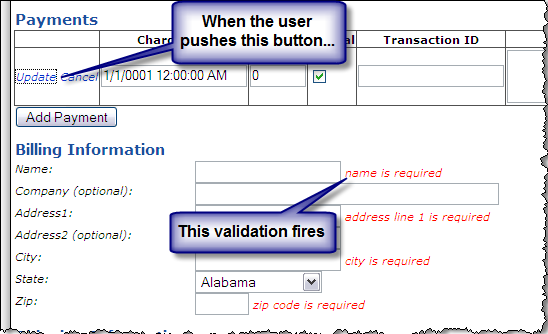

If you want to put a gridview on a form with validators, you'll run into validation issues very quickly. The LinkButton controls cause the page validation. Immediately I looked for a "ValidationGroup" property on the GridView, but unfortunately, none exists.

The solution is to handle the "DataBound" event on the GridView, and manually find the link buttons. The following code loops through the controls in the first cell of the row currently being edited.

	protected void Page_Load(object sender, EventArgs e)
	{
	    dgMyGrid.DataBound += dgMyGrid_DataBound;
	}
	
	private void dgMyGrid_DataBound(object sender, EventArgs e)
	{
	    if (dgMyGrid.EditIndex >= 0)
	    {
	        //Turn off validation on the link buttons, because we don't want other page validation issues interfering.
	        foreach (Control currControl in dgMyGrid.Rows[dgMyGrid.EditIndex].Cells[0].Controls)
	        {
	            LinkButton lb = currControl as LinkButton;
	            if (lb != null)
	                lb.ValidationGroup = "no-validation";
	        }
	    }
	}