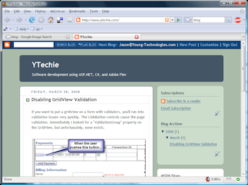
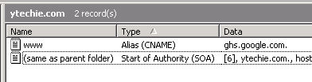

Every great developer feels the urge to write a blog at one point or another in their life. Personal blogs let you share photos with family members, and easily announce what is going on in your life. Technical blogs serve many purposes:

*   Practicing your writing and communication skills
*   Help out the development community. We've all been stuck, and we've all been thankful of the person that ran into the same problem, solved it, and posted the answer in detail on their blog.
*   Keeping a journal of the problems we've run into in the past. Developers have a tendency to experience the same problems again, but often forget the answer (at least I do!). 

 

Once you decide to write a blog, you have a number of options:

1.  Write your own - If you have enough time to write a full featured blog platform, I envy you. I've seen people do this, and they probably had fun. The reality is that blog software is to the point where it is fairly mature. Your own software may pale in comparison, unless you absolutely only need a couple of features.
2.  Use an existing package. Personally, I'm a Windows/Microsoft/.NET guy by trade. If you're in the same boat, some of the common solutions are [Community Server](http://www.communityserver.org/), and [Subtext](http://www.subtextproject.com/). Community Server was too slow and complicated the last time I tried it. It's just plain overkill for most users. Subtext is great, but I'm not sure how much work has gone into it lately. I have a big wish list of features for Subtext.
3.  Use a professional blogging service. That includes [WordPress.com](http://www.wordpress.com/), [Livespaces.com](http://home.services.spaces.live.com/), or [Blogger.com](http://www.blogger.com/). I'm sure there are others, but they're the big ones. Professionals tend to shy away from services like these. 

In the past, I have tried the first 2 options. I've been there and done that, and I'm just tired of spending hours configuring a blog, setting up hosting, setting up DNS, etc.

Most experts recommend _against_ using one of the blogging services. When you use those services, by default, the address is part of their domain. For example, **yourblog.wordpress.com**. I agree that this isn't ideal. Blogger does offer FTP publishing, but I've heard that it's fairly limited, and not very popular.

The alternative that I'm experimenting with on this blog, is using a [CNAME](http://www.zytrax.com/books/dns/ch8/cname.html) record, so that I can use my domain, but still use the blogger or wordpress service. If you configure your blog this way, YOU control the name, but use a special DNS entry to point it at their server. The result is that you can have a friendly URL such as **blog.yourdomain.com**. If you don't feel like using a subdomain, you can actually set up your CNAME records so that **yourdomain.com** and **http://www.yourdomain.com** are addresses for your blog. You don't even need a hosting provider, but you DO need a DNS provider. This is exactly how this site has been configured.

Here are the DNS settings for the www.ytechie.com domain. Simple huh?

 

How does this affect SEO (search engine optimization)? Good question! There isn't a lot of clear data right now. CNAME records are at the DNS level, so many speculate that Google goes strictly off of the name. As time goes on, we'll be able to see how Google indexes the pages on this blog.

In a follow-up post, I'll be discussing some of the key differences between Wordpress.com and Blogger.com. I'll also show you how to configure each of them to use a CNAME record.