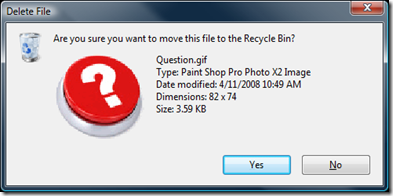

On the right side of my blog, you'll notice that I added a question button. If you have a question that is technology or software related, please ask! If your question is stupid, I admit, I will probably ignore it. However, if you have a good question, I'll try my best to answer it with its very own blog post.

 

A [former co-worker](http://software.jonandnic.com/) of mine mentioned that he doesn't have a contact page because he's afraid of the questions he'll get. I know exactly where he's coming from. I'm hoping that every once and a while there will be a jewel in there and we can both benefit. Of course if I choose your question you'll get a link from this blog, and all the fame and fortune that comes with it.

On a side note, I got the cool looking dialog below when I went to delete the question mark image off my computer. I think Windows would be a lot cooler if they bought some images off of [iStockPhoto](http://www.istockphoto.com/).

