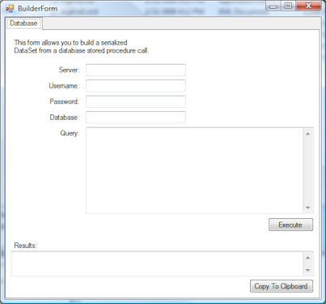

Quite a while ago I wanted to do some unit testing with DataSet's and DataTable's as input. In code, there isn't really an _easy_ way to generate them, especially if you want them to be a realistic subset of the real data in your database.

My solution was to build a program that acted like SQL Server's Management Studio, but who's output is a serialized DataSet. The resulting XML can simply be embedded into your unit test project. In your unit test, you simply deserialize the DataSet XML into a DataSet.

 

Is anyone interested in me posting the source code and compiled EXE? I'll have to clean it up a bit, so I wanted to see if there was enough interest, of if it's something I'll just keep using in-house.