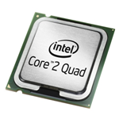

Two days ago Intel dropped the price on the Q6700 (2.66Ghz) processor in **half**. Newegg currently [has this processor for $299](http://www.newegg.com/Product/Product.aspx?Item=N82E16819115027), and you get Unreal Tournament 3 for free.

Before the price drop, I was recommending the Q6600 (2.4Ghz) because of its low price. Right now, [it's going for $229.99](http://www.newegg.com/Product/Product.aspx?Item=N82E16819115017).

If you're not going to overclock, and you don't plan to take advantage of all of the cores, then the Q6700 is probably a safe bet because of the slightly higher clock speed (10% higher).

If you're trying to save money at all, or you plan to overclock, the Q6600 is still an amazing processor. It's easy to overclock to 3Ghz, while still running extremely cool.

Both of these processors would be great for a VMware server. Paired with some fast hard drives, and a couple gigs of memory, you could easily run 4-8 virtual machines (depending on what they're doing of course).

It's amazing how cheap it is to build what I would consider a fairly top of the line machine.