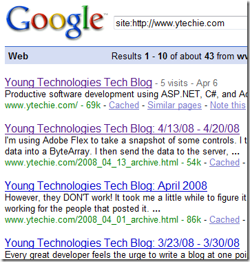

By default, the title tags that Blogger uses are less than ideal. Search engines put a lot of value on your title tags, so it's worth taking some time to make sure that they're set up correctly.

When I initially set up my blog, I set the title to &quot;Young Technologies Tech Blog&quot;. Look what happened in the search results:

 

YUCK! There are **two** **major** problems here. The first is that the titles are not at all useful to a human. How would you expect anyone to click on titles like this?

The second problem is that my title tags don't tell Google anything interesting about my site. You want the search engines to figure out the keywords in each of your pages, and having those keywords in the title reinforces that.

In &quot;classic&quot; blogger, you would simply use
  <pre class="xml" name="code">&lt;title&gt;&lt;br /&gt;&lt;mainorarchivepage&gt;&lt;$BlogTitle$&gt;&lt;/mainorarchivepage&gt;&lt;br /&gt;&lt;itempage&gt;&lt;blogger&gt;&lt;$BlogItemTitle$&gt;&lt;/blogger&gt; - &lt;$BlogTitle$&gt;&lt;/itempage&gt;&lt;br /&gt;&lt;/title&gt;</pre>

instead of:

<pre class="xml" name="code">&lt;title&gt;&lt;$BlogPageTitle$&gt;&lt;/title&gt;</pre>

This would use the title of the post item as the title of the page. The problem is the &quot;new&quot; blogger has a completely different template system. Be sure to back up your template before editing it! Here is what I did, step-by-step:

*   Shorten your actual blog title. I was unable to figure out how to remove the blog title from each post page, without losing the post title. Unfortunately Blogger doesn't have a token for the item post title. For my blog, I changed the title to &quot;YTechie.com&quot;, which I think is a reasonable prefix for my post page titles.*   Customize the title tag in your template. Do this by editing the HTML, expand the widget templates, and put the following code in place of the existing title tag. This will allow you to have a custom title just for the front page.

<pre class="xml" name="code">&lt;b:if cond='data:blog.pageType == &amp;quot;index&amp;quot;'&gt;
 &lt;title&gt;Front Page Title (change this)&lt;/title&gt;
&lt;b:else/&gt;
 &lt;title&gt;&lt;data:blog.pageTitle/&gt;&lt;/title&gt;
&lt;/b:if&gt;</pre>

*   In the code above, put in the title you want for the front page. Try to keep it around or under 66 characters. For additional guidelines, [consult this guide](http://www.seologic.com/faq/title-tags.php).*   Since you changed the title of your blog to something shorter, that will show up in the header as well. To customize the header text, replace this:

<pre class="xml" name="code">&lt;b:if cond='data:blog.url == data:blog.homepageUrl'&gt;
   &lt;data:title/&gt;
 &lt;b:else/&gt;
   &lt;a expr:href='data:blog.homepageUrl'&gt;&lt;data:title/&gt;&lt;/a&gt;
 &lt;/b:if&gt;</pre>

With this:

<pre class="xml" name="code">&lt;b:if cond='data:blog.url == data:blog.homepageUrl'&gt;
   This is my header title (change this)
&lt;b:else/&gt;
   &lt;a expr:href='data:blog.homepageUrl'&gt;This is my header title (change this)&lt;/a&gt;
&lt;/b:if&gt;</pre>