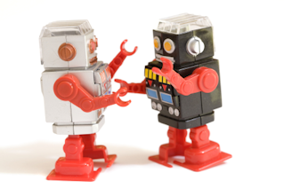

My buddy Steve has a [great post on his blog](http://designed2print.wordpress.com/2008/04/04/technology-cant-keep-up-with-me/). He's asking why his computer isn't smarter. For example, changing a color in a few hundred graphics files.

 

The truth is, computer technology hasn't really come that far. The basic building blocks are the still the same. At the lowest level, the processor is dealing with 0's and 1's. The layer above that, it's dealing with integers and floating point numbers. Skip a few layers, and you have your operating system, and then you have your graphics application for example.

Each layer can even be broken down by itself. The graphics application probably used some graphics libraries, and also uses some common control libraries.

Layer upon layer, we build something that does more and more with each generation. Faster and friendlier.

The truth of the matter is, we haven't had a true computing paradigm shift yet. No one can predict when the next computer revolution will take place. I'm not talking about connecting computers, or coming up with a new way to read email. I'm talking about something truly revolutionary. The time at which computers start speaking our language. Unlike today, where computers force us to speak their language.

Want to change the color in those image files we talked about? Write a macro, click some buttons. You will do what I say, or you will not get anything done. In the future, you tell your computer what to do, and it will be done.

When this revolution takes place, will only the creative survive? What will happen to those of us that are translators between the humans and the computers?