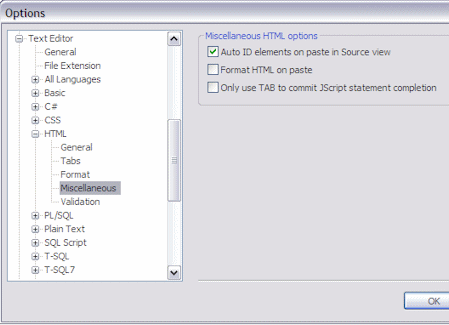

Don't you hate it when you copy an ASP.NET server control without an ID, only to have it add one when you paste it?

For example, look at this code:
<pre class="xml">&lt;asp:RequiredFieldValidator runat="server" /&gt;
&lt;asp:RequiredFieldValidator ID="RequiredFieldValidator1" runat="server" /&gt;</pre>
I took the first line, copied it and pasted it, and got the second line. It's rare that I need to reference a validator in my CodeBehind.

Here is the option to disable this functionality in the Visual Studio options (Tools-&gt;Options):

Simply uncheck the "Auto ID elements on paste in Source view" option.