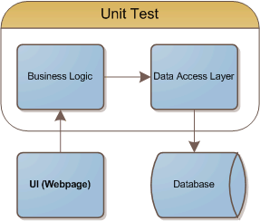
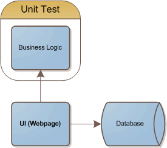

Lately I've been giving a lot of thought to using [LINQ](http://msdn.microsoft.com/en-us/netframework/aa904594.aspx) to access my database instead of using NHibernate. I've been a little confused as to how LINQ would work in a data access layer, but I'm starting to think it makes sense as a **replacement** to the data access layer.

This article was inspired by the [Google App Engine](http://www.djangoproject.com/). Using the [Django framework](http://www.djangoproject.com/) for database access is stupidly simple. They're able to focus on getting something done, which is good enough in a lot of cases. Not every project has to be an N-Tier enterprise application.

Primarily, I write eCommerce websites. Consider the following diagram, which gives you a rough idea of how I've traditionally structured my applications:

 

Notice that a lot of code is being tested. The sweet side of me likes unit tests, but the wheat part of me is telling me to simplify code when possible to minimize the need for unit tests. I've traditionally wanted a lot of unit tests at the data access layer because it tends to be a source of a lot of issues due to it's complexity. It's complexity is a result of [impedance mismatch](http://en.wikipedia.org/wiki/Object-Relational_impedance_mismatch).

Code that is a good candidate for unit testing:

*   Logic/utility/static functions
*   Code that will be used in a lot of places, and has a well defined contract
*   Code that needs the highest levels of reliability  

Now consider what happens when we use LINQ and the [ADO.NET Entity Framework](http://msdn.microsoft.com/en-us/library/aa697427(vs.80).aspx). The impendence mismatch has been minimized because the entity framework has automatically written our model code to match the database. It has also been my experience that the queries that are not trivial are usually not re-used. In other words, **query complexity is inversely proportional to the frequency of re-use**.

The end result is that our code has been greatly simplified. Now our unit tests can focus on the business logic. We'll actually have more time for unit testing, which should lead to more stable code where it is needed most.

Sure, our UI will contain what are basically database queries. The fact is that many pages simply need a specific set of data that will populate a drop down list for example. I know that it might give people a bad feeling (as it does to myself), but I think it's something we need to get over. If you want to test the page, in most cases you can just run it, and see that it's working. In conjunction with a good web testing tool, it would be easy to have high levels of reliability.

 

Obviously there are a lot of places where this is a bad idea. I'm certainly not condoning a complete lack of a data access layer for every application. I'm applying the 80/20 rule. Places it might not make sense, or where it's gray:

*   A logic class that needs to make frequent, repeated database calls.
*   An application that requires a certain level of testability.
*   An application that contains some extremely common queries that may or may not be trivial.