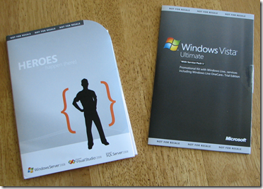

I have some free software that I'd like to give away! Here is your chance to win one of the following:

*   Visual Studio 2008 Standard Edition AND Windows 2008 Enterprise (64-bit and 32-bit) - Including the virtual keys.
*   Windows Vista Ultimate with SP1  

These copies are fully functional, unused full versions. Microsoft asks that you stop using them after a year, but they have stated that there is no technical limitation that would keep you from using them past that date.

 

There is no purchase necessary to enter. There are 3 ways to enter:

*   
Add this site ([http://www.ytechie.com](http://www.ytechie.com)) to your blogroll.
*   
Subscribe to the [RSS Feed](http://feeds.feedburner.com/ytechie).
*   
Post a comment to this post
  

If you add this site to your blogroll, or subscribe, make sure you post a comment or send me an email so I can enter you.

The site that sends me the most unique visitors according to my logs will get first pick at which one they want. The other winner will be chosen randomly. That will give everyone a chance at winning, but gives some incentive to link to our site.

The good news is that this isn't the most popular site on the Internet, so you might actually have a shot at winning!

The contest ends May 31st, and I'll pick and announce the winners in a blog post on June 1st.