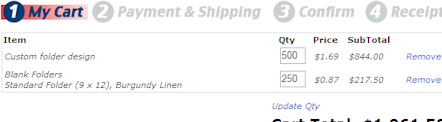

I created a shopping cart for a website that can display multiple types of items that implement IShoppingCartItem. When the GridView would display items that were different type, I would get this exception:

**Exception Details: System.Reflection.TargetException: Object does not match target type.**

I found a lot of solutions that I didn't really like. For example, every shopping cart item type could implement [ITypedList](http://msdn.microsoft.com/en-us/library/system.componentmodel.itypedlist.aspx).

What I ended up doing was creating a CartGridItem class that implements IShoppingCartItem:

	public class CartGridItem : IShoppingCartItem
	{
		private readonly IShoppingCartItem _baseCartItem;
		public CartGridItem(IShoppingCartItem baseCartItem)
		{
			_baseCartItem = baseCartItem;
		}
		#region IShoppingCartItem Members
		public string ProductCode
		{
			get { return _baseCartItem.ProductCode; }
		}
	//...end of code sample...

This has worked great, and I don't have to make any changes when I create a new item that implements that interface!

