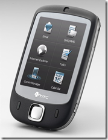

A few months ago, I went ahead a bought an [HTC Touch](http://www.htctouch.com/) Smartphone. I initially wanted the Pocket PC platform, so that I could easily sync up with Outlook and have all of my contacts and appointments with me at all times. Synchronizing that information with a typical phone is very painful.

 

At first, I didn't really like the HTC Touch. It's slow (compared to a standard phone or an iPhone). The biggest issue was getting push email to work. The guy at the Sprint store claimed that you would just enter your email credentials, and push email would magically be enabled. I ensured him that it wasn't that simple, but he still insisted.

With pocket Outlook I was able to set up access to my GMail account using IMAP. The problem was that it was slow, and push email didn't really work at all. Research led me to the conclusion that Pocket Outlook really sucks at IMAP. I even tried another email client ([Flexmail](http://www.pocketinformant.com/products_info.php?p_id=mail&)), but I still wasn't satisfied.

Then, I found out that you could use the "Live" application on the phone to get real-time email from Hotmail using the option on the device for receiving emails "as items arrive". I signed up for a Hotmail account, and set my GMail account to forward a copy of all messages. This option proved to be very flaky, but the email delay wasn't too bad. After doing some research, it seems as though this option pretends to be push email, but is in fact very frequent polling. I would occasionally lose my data connection, and the mail application would just give up.

 

Now on to the option that actually works, and the ONLY option that has worked consistently, reliably, and without much delay (5-15 seconds). Sign up for the ["Live" option on Mail2web](http://live.mail2web.com/). This basically gives you your own free Microsoft Exchange account. Set up your email accounts for forward a copy of your messages to this account. Then use the credentials they supply to connect your device. On Windows Mobile 6, you can set it up in ActiveSync on your desktop, or through the device itself.

This option has worked flawlessly for me, even when I can barely get a signal. I get email no matter where I'm at, and I can save time because I don't need to compulsively check my computer for new mail. I'm guessing this is really the only well supported option for mail, because this is how business customers would set it up.

For extra credit, I copied the XP email notification sound off my system, amplified it (using [Audacity](http://audacity.sourceforge.net/)), and then set that as my mail notification. I get the recognizable email sound, which is pretty confusing to those around me when there are no computers around.

Enjoy your real-time push email!