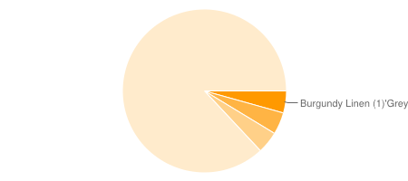

On a recent project, I need a quick and dirty report that would give a breakdown of statistics for orders that have been placed. I didn't need any fancy drill down, hover help, or transition effects. This sounds like a perfect use for the [Google Chart API](http://code.google.com/apis/chart/)! There is no limit on use. All you have to do is construct a URL containing your data, and that is the URL for an image containing your chart. Here is a sample of a chart that we're going to generate in this post:

First, we need a quick way to generate the data. I used a SQL Server stored procedure, because I knew it would only take a matter of minutes to create. Here is an example of how I retrieved the data for 2 report sections:

	--Paper Breakdown
	Select IsNull(p.PaperName + ' (' + Cast(Count(o.PaperId) as VarChar(Max)) + ')', 'Unspecified'),
		count(o.PaperId)
	From Orders o
	Left Outer Join Papers p on o.PaperId = p.Id
	Group By p.PaperName
	Having Count(o.PaperId) > 0
	--Style Breakdown
	Select IsNull(s.Sku + ' (' + Cast(Count(o.StyleId) as VarChar(Max)) + ')', 'Unspecified'),
		count(o.StyleId)
	From Orders o
	Left Outer Join Styles s on o.StyleId = s.Id
	Group By s.Sku
	Having Count(o.StyleId) > 0

Then, I simply had to call the stored procedure, and put the data into a DataSet called "_data" (code not shown). Then, I wrote a quick method to get the URL for a Google chart:

	private static string getPieChartUrl(DataTable dt)
	{
		if (dt.Rows.Count == 0)
			return "";
		StringBuilder sb = new StringBuilder();
		sb.Append("http://chart.apis.google.com/chart?chs=600x200&cht=p"); //Base URL
		//Pie slice data
		StringBuilder sliceData = new StringBuilder();
		foreach (DataRow currRow in dt.Rows)
			sliceData.Append(currRow[1] + ",");
		sliceData.Remove(sliceData.Length - 1, 1); //Remove the trailing comma
		sb.AppendFormat("&chd=t:{0}", sliceData);
		//Pie label data
		StringBuilder labelData = new StringBuilder();
		foreach (DataRow currRow in dt.Rows)
			labelData.Append(currRow[0] + "'");
		labelData.Remove(labelData.Length - 1, 1); //Remove the trailing comma
		sb.AppendFormat("&chl={0}", labelData);
		return sb.ToString();
	}

My ASPX page then has 2 image controls:

	<h2>Breakdown by Paper Type</h2>
	<asp:Image runat="server" ID="imgPiePapers" />
	<h2>Breakdown by Style SKU</h2>
	<asp:Image runat="server" ID="imgPieStyles" />

Then, simply wire up the data:
	
	imgPiePapers.ImageUrl = getPieChartUrl(_data.Tables[0]);
	imgPieStyles.ImageUrl = getPieChartUrl(_data.Tables[1]);