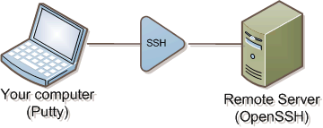
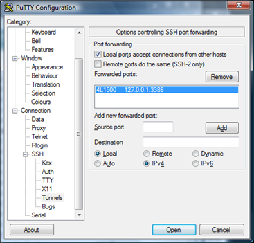
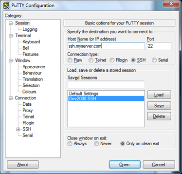

Here are step-by-step instructions for setting up a quick and dirty SSH tunnel to another network. This gives you the ability to connect to any machine and port that the remote machine has access to. The process is so simple, it should take you less than 10 minutes.

Why would you want to do this? Well, it's a pretty slick way to connect to a remote machine on a single port and have access to all of the network resources of that machine. Your connection acts like it's originating from the server. As a test, I set it up on my development computer running Visual Studio. Visual Studio runs web projects in a special web server that is only accessible from that machine. Using SSH, I was able to make it accessible to anyone on my network using my computer as a gateway.

 

In this example, we're going to be using two free pieces of software. On the server, we're going to use a [version of OpenSSH](http://sshwindows.sourceforge.net/) that uses a stripped down version of [Cygwin](http://www.cygwin.com/) to run on Windows. On the client, we're going to use [Putty](http://www.chiark.greenend.org.uk/~sgtatham/putty/).

The first step is to download and install both programs. Here are the links to the download pages for each product:

*  [Windows OpenSSH](http://sshwindows.sourceforge.net/download/)
*  [Putty](http://www.chiark.greenend.org.uk/~sgtatham/putty/download.html)  

On your the server, where OpenSSH was installed, we need to run a couple of quick commands at the command line (go to start->run and type "cmd"):

* mkgroup -l << ..etcgroup
* mkpasswd -l << ..etcpasswd
* net start opensshd  

You're now running an SSH server! Now we can configure the client (Putty).

Open up Putty. It doesn't require installation, so you can simply double-click on the executable. In the tree on the left, navigate to Connection->SSH->Tunnels. We're going to add a list of local ports that will be routed to machines that the server has access to. For example, if we want to access remote desktop on the remote machine, we can put a destination of 127.0.0.1, and a port of 3386. The source port is the port that we'll connect to on our machine. Remember to click "Add" when adding a forwarded port.

 

You should end up with something like this. Now, go to the "Session" section in putty. Enter the host name of the server you want to SSH into. Then, select "SSH" as the connection type. Then press "Open". You'll be prompted for a username and password, which should be an account on the server you're connecting to.

 

The beauty of this is that you don't have to set up the port list on the server, it's all configured on the client. You can even let computers connect to your computer and have them be routed to the remote machine.

Hopefully that is enough information to get you started. I'm no SSH expert, but it was pretty easy to get set up when doing it this way.