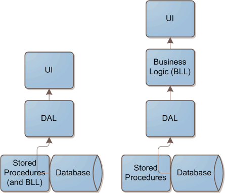

Today's post is a case study of sorts, about my former employer, who had an interesting architecture. It's roots were VB6 and SQL server (version 6 I believe). They decided to put as much logic in their stored procedures as possible. The arguments being:

*   Easy to update (fix, improve) on-the-fly.*   Hard to work with data (multiple tables, arrays, etc) in VB6 and ASP, at least compared to .NET.  

Given the circumstances, I don't think that I would go back and change history if given the chance.

The problem is that the world has changed, and their architecture just doesn't scale well. The biggest problem is in the area of reporting (which is now primarily .NET). Since all the data manipulation and logic is in the stored procedures, the database is forced to do all the work. In a small application with not a lot of data, this probably isn't a big deal. The report runs for a few seconds and no one really experiences a slow down.

The problem arises when there is a lot of data. Easily millions of rows in dozens of tables. The current fix is to scale vertically, meaning that they throw more hardware (AKA money) at the problem.

The real solution to the problem is to scale horizontally. There are two main ways of doing this. The first is to add more database servers. The problem is that this isn't really all that easy. The software to do this is getting better, but the fact remains that two different systems now have to stay synchronized. I've read articles about businesses that have scaled their business, and a common theme is that **databases are one of the hardest parts of your architecture to scale**.

The second aspect of scaling is to reallocate where your work is being done. You need to start thinking of the database as a...well....a database! The first and foremost purpose of a database is to store massive amounts of data, and allow you to quickly retrieve that data.

Databases are amazingly fast when you use them simply as a place to store data. If you design your database correctly, and set up indexes that are optimized for the ways you want to retrieve your data, there should be no reason to wait for your data. SQL Server can easily handles millions or even billions of rows, and query any of them almost instantaneously. Even with multiple queries being executed concurrently or in succession.

Consider the following diagrams:

 

The existing architecture is on the left, and the proposed structure is on the right. It's not a big change, I'm simply suggesting that the business logic be moved from the stored procedures, into the code.

The first reaction that I usually receive from this suggestion is that the code is going to be ugly compared to the corresponding SQL. The reality is that the SQL is ridiculously complicated (at least in my experience). SQL is great for set based logic, but really starts to break down when trying to do object oriented or procedural operations.

The fact is that .NET is great at **processing** massive amounts of data. First of all, it's incredibly fast. If you're writing your code correctly, you'll be amazed at how fast it can process data.

More importantly, if you're using a programming language to manipulate your data instead of T-SQL, you can really start to break down the problem at hand. Databases are traditionally very bad at breaking a large problem into smaller problems. Sure, you can call other functions and stored procedures, but you can tell that it's not the strongest feature of the database. A programming language like .NET lets you pass data around in any structure that you can conceive.

The other major advantage of processing the data in your code, is that you can now easily build testable code. Any code that you can easily test will have less bugs, and should be easier to maintain in the long run.

If your data is now being processed and organized in your code and not the database, you are probably ready to scale horizontally. It's relatively easy to add more front end servers. Since they all hit a common database, there aren't really any synchronization issues.

So does this really work? Of course. I'm not the first to think of it by any means. Take any of the largest websites on the Internet, and look at how they have [designed a scalable](http://highscalability.com/) architecture. Digg.com has always had [database scalability issues](http://highscalability.com/digg-architecture) with their MySql servers, so they try to minimize them as much as possible. Twitter uses **ONE** database server to handle [thousands of requests per second](http://pragmati.st/2007/5/20/scaling-twitter). eBay.com doesn't even do joins in their database. They would never be able to scale if they put that burden on a database that handles [26 billion SQL queries each day](http://highscalability.com/ebay-architecture).

Microsoft has made matters worse by integrating the .NET CLR into SQL Server. You can now write .NET code that gets executed on your database server. This is a great tool, but it must be used with great care. This isn't an excuse to write more code in your database.

In summary, databases are an expensive commodity, don't abuse them! Be careful how much you do in the database, and ask yourself if you can move some processing into code, where it is more easily scaleable.

Just recently, Scott Hanselman came out with a [podcast about website scaling](http://www.hanselman.com/blog/HanselminutesPodcast114WebsiteScalingWarStoriesWithRichardCampbell.aspx). If you're looking for more site scaling concepts, it's worth a listen.