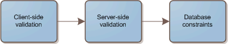

A discussion came up at work recently about the extent of constraint usage in your databases. There were basically 2 camps:

1.  Constrain everything humanly possible. If it's an integer that wouldn't normally be negative, add a ">= 0" constraint.
2.  Constrain primarily where it's necessary to maintain referential integrity.  

Consider the following diagram. It's a map of the flow of data from your user, which eventually makes its way into the database.

Since we're getting input from a user, and they're the one that can fix invalid data, we validate data at the top layer. There's usually no getting around this. In fact, for the best user experience on the web, you're going to perform some JavaScript validation. Then you'll probably validate it again on the server, in case they have JavaScript disabled.

At this point, unless there is a bug in your code, you're sure that the data is valid. You may not know if it's referentially valid. Validating the input a third time in the database is _probably_ overkill. It's also a potential performance bottleneck.

Yes, there are many times when this doesn't apply. For example, when **multiple systems are interacting with the same database**, and one counts on the data in a certain format. The only way to guarantee you get data in a format you expect is to constrain it at the database level.

In general, I avoid strict constraints at the database level. The biggest reason is that it requires your to synchronize all of your validators. They all have to agree on the same set of restrictions, or the code will fail. That goes against the LEAN and Agile philosophies. When I want to allow negative numbers in my integer field, it's much easier to simply change it in my application. This is amplified if you have to talk to a DBA to make changes.

Another reason to avoid constraints is that they can't always understand the data like the application can. For example, should a constraint attempt to ensure that valid email addresses are entered? If you're storing a persons age, do you constrain it so that it can't go above 500? 200? 100?

 

Now let's assume that there is a bug in your application code, and you didn't have a trusty constraint to stop it. You now have invalid data in your database. The good news is that you now have the potential to clean it up, or adapt your code to deal with it. The bad news is that if that value is used in a calculation that could have bad side effects, you could have big problems.

As with anything, there is no hard and fast rule for every situation, but we can at least make some general guidelines.

Think LEAN. Anything that doesn't provide value to the customer is waste. Think Agile, requirements change, be adaptable.