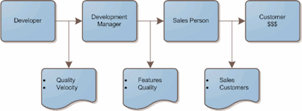

No matter what your position is, one of the most important responsibilities is to know who your customer is, because they're the one that you need to make happy. If you think it's the where the money comes from, you're probably wrong.

As a developer for a medium size company, I admit having made the mistake in thinking that sales were my primary measure of success. After all, I'm working on an e-commerce site for customers. _I was wrong_. My customer is actually the person making decisions about the features that go into the product. In a traditional software company, if you're a developer, your customer is your immediate manager.

Here is a map of the [value stream](http://en.wikipedia.org/wiki/Value_Stream_Mapping) for a typical software company:

We can only be measured based on what we have control over. As a developer, you're not talking to the customer, and you're probably not picking the features that should be developed. What makes you think you can affect sales?

The development value stream is a hierarchy of levels designed to create focus. As a developer, you need to create features that exhibit quality, and you need to maintain a reasonable velocity. Each level in the hierarchy needs to be doing their job well, or the level above them will fail. Ultimately you do affect sales, but it is with an indirectly. Keep in mind that it doesn't make you any less important.

Do yourself a favor today. Take a few moment to figure out who your immediate customer is. Then ask yourself what they expect. If you focus on that, you'll be doing your part to make the company successful.