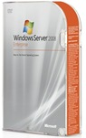

I attended the &quot;[HEROS happen {here}](http://www.microsoft.com/heroeshappenhere/default.mspx)&quot; event in Milwaukee Wisconsin. This launch event covered [Windows Server 2008](http://www.microsoft.com/windowsserver2008/en/us/default.aspx), Visual Studio 2008, and [SQL Server 2008](http://www.microsoft.com/sqlserver/2008/en/us/default.aspx). I'm including my notes here in case they are of use to anyone.

Microsoft always does a good job putting on events, and this was no exception. There were a lot of third party vendors, and there was no lack of freebies from all. Microsoft gave everyone a nice lunchbox with a decent breakfast inside.

Microsoft also gave out copies of Vista Ultimate SP1, Windows Server 2008 Enterprise (including a virtual key), and Visual Studio 2008 Standard. Stay tuned for a post where I'm going to have details about giving away some of this software to **you**.

****

**Windows 2008 Server**

*   [Powershell](http://www.microsoft.com/windowsserver2003/technologies/management/powershell/default.mspx) can easily manage remote machines, including executing a command line remotely.*   Group policy is now a service*   Group policy now has extensive logging*   Custom group policy (preferences) allows you to arbitrarily add registry settings or files.*   [RSAT](http://www.microsoft.com/downloads/details.aspx?FamilyId=9FF6E897-23CE-4A36-B7FC-D52065DE9960&displaylang=en) - Allows you to manage your 2008 policy settings with Vista.*   WinRS is basically an SSH alternative for Windows.*   You can set up a custom view to filter (search) for event log events for all computers in your network.*   The old 64KB receive Window limitation has been replaced with a receive window system that auto-tunes. This provides a significant increase in network speed. The benefit increases as the latency increases.  

**Virtualization &amp; Hyper-V**

*   The feature set appears to be one step ahead of VMware Server in many ways. For example, you can do CPU throttling and multiple snapshots.*   There is a version that will give you a bare bones version that is ONLY Hyper-V, and it's only 40,000 lines of code.*   [Application Virtualization](http://www.microsoft.com/systemcenter/softgrid/default.mspx) (SoftGrid)*   Requires VT extensions*   Can be scripted using Powershell*   Based on the OS you buy, you can get free Windows licenses for the virtual machines. For example, if you buy Datacenter Edition, you can run **unlimited** Windows 2008 virtual machines on it without buying multiple licenses. Enterprise edition covers 4 virtual machines. Standard covers 0\. You actually get virtual keys for the virtual machines.*   Licensing is per socket, not per core (which is the same as VMware licensing)*   Terminal services features EasyPrint so that virtual printers don't have to be installed. It uses XPS (think MS PDF) as a common communication format.*   You can set up a terminal services gateway to provide access to any terminal server behind your firewall.  

****

**Visual Studio 2008**

*   MOSS is very popular right now (really?).*   [Expression Web](http://www.microsoft.com/expression/products/overview.aspx?key=web) just released version 2.0\.*   HTML 5 is about to be finalized.*   CSS 2.1 is about to be finalized.*   Visual Studio allegedly writes decent cross-browser XHTML code.*   ASP.NET starter kits are available at [www.ASP.net](http://www.ASP.net), and look pretty interesting.*   The [AJAX control toolkit](http://www.asp.net/ajax/ajaxcontroltoolkit/samples/) has some very impressive controls that let you easily add functionality to your pages. For example, there is one that [adds a watermark to a TextBox](http://www.asp.net/AJAX/AjaxControlToolkit/Samples/TextBoxWatermark/TextBoxWatermark.aspx). Another [confirms button actions](http://www.asp.net/AJAX/AjaxControlToolkit/Samples/ConfirmButton/ConfirmButton.aspx) (delete for example).*   Test inheritance*   The ScriptManager can localize formats*   Easily call server methods with JavaScript*   New profiling tools*   More tools are available in Professional that used to be only available in higher editions.