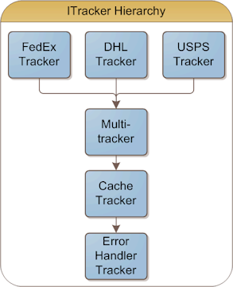

As requested, here is a real world example of how I used [dependency injection](http://www.ytechie.com/2008/06/i-finally-get-the-point-of-inversion-of-control/) to simplify a project, increase modularity, and subsequently increase testability.

Here's the project. I have a successful website called [SimpleTracking.com](http://www.SimpleTracking.com) which allows you to [track packages](http://www.SimpleTracking.com) using a simple, common user interface. It also allows you to track pages using RSS.

Here is a list of features:

*   Supports multiple shippers, including FedEx, DHL, and USPS. The tracking number is resolved to one of them, and if a tracking number could belong to more than one, they are called simultaneously, and the one that returns the results is used.
*   Results are cached to avoid overusing the shippers servers
*   Errors are handled appropriately  

I boiled the design into a tree of classes:

 

To greatly simplify the design, I decided that each module would implement a common interface. After all, they all take in a tracking number, and return tracking data. Here is the ITracker interface:

	public interface ITracker
	{
		TrackingData GetTrackingData(string trackingNumber);
	}

Simple enough? **Every **class in the diagram above implements the same interface. If I want to add additional functionality, such as logging for example, I can simply add a class to the chain, and implement the same interface.

Now I can wire it up with Spring.NET:

	<object name="postUtility" type="YTech.ShipperInterface.Tracking.Http.PostUtility, YTech.ShipperInterface" />
	
	<!-- The trackers that actually do the work -->
	<object name="uspsTracker" type="YTech.ShipperInterface.Usps.Tracking.UspsTracker, YTech.ShipperInterface">
		<constructor-arg ref="postUtility" />
		<!-- Code removed for readability... -->
	</object>
	<object name="fedexTracker" type="YTech.ShipperInterface.FedEx.Tracking.FedexTracker, YTech.ShipperInterface">
		<constructor-arg ref="postUtility" />
		<!-- Code removed for readability... -->
	</object>
	<object name="dhlTracker" type="YTech.ShipperInterface.Dhl.Tracking.DhlScreenScrapeTracker, YTech.ShipperInterface">
		<constructor-arg ref="postUtility" />
	</object>
	<object name="simulationTracker" type="YTech.ShipperInterface.Tracking.Simulation.SimulationTracker, YTech.ShipperInterface" />
	
	<!-- Combine all of the other trackers into one stream -->
	<object name="multiTracker" type="YTech.ShipperInterface.Tracking.MultiTracker, YTech.ShipperInterface">
		<constructor-arg>
			<list element-type="YTech.ShipperInterface.Tracking.ITracker, YTech.ShipperInterface">
				<ref object="simulationTracker" />
				<!-- Order these by popularity -->
				<ref object="fedexTracker" />
				<ref object="uspsTracker" />
				<ref object="dhlTracker" />
			</list>
		</constructor-arg>
	</object>
	
	<!-- Cache the upstream tracking data -->
	<object name="cacheTracker" type="YTech.ShipperInterface.Tracking.CacheTracker, YTech.ShipperInterface">
		<constructor-arg ref="multiTracker" />
	</object>
	
	<!-- Handle errors by logging them, and returning a special ErrorTrackingData object -->
	<object name="MainTracker" type="YTech.ShipperInterface.Tracking.ErrorHandlerTracker, YTech.ShipperInterface">
		<constructor-arg ref="cacheTracker" />
	</object>

Now in my code, this is all I have to do:
	
	var ctx = ContextRegistry.GetContext();
	var tracker = (ITracker)ctx.GetObject("MainTracker");
	var td = tracker.GetTrackingData("my tracking number");

Every piece I've written is fully testable. I even created a class that posts data to a remote web server, and returns the response. This allows me to completely test the tracker classes. They don't care if they're hitting against a real server, or an in memory request/response mock class.

I have nearly 100% test coverage, and making changes to the site is a breeze.

The next step is to convert the actual web project to an MVC project so that I can unit test the actual page functionality.

Hopefully I've given a good example of how inversion of control can be a really good thing. Have any more questions about the architecture? Feel free to leave a comment.

Note: I haven't replaced the code on the live SimpleTracking.com site yet, but I plan on upgrading in the next couple of weeks.
