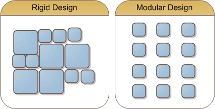

I think I'm finally starting to understand the [Inversion of Control](http://en.wikipedia.org/wiki/Inversion_of_Control) principle (aka Dependency Injection). I had a hard time understanding most examples out there, because they appeared to be solving problems that didn't even seem like real problems to me. For years I've been writing classes, testing them, and hooking them together. In many cases, I was already practicing inversion of control. The benefit I wasn't seeing was the fact that you can separate the modules in your code and the connections between them.

 

When you really commit yourself to breaking the problem down into manageable pieces, it _does_ create more testable and reusable code. I already knew that, but when you starting using IoC, it really starts to drive that point across. It's similar to the effect that unit testing has. When you start writing unit tests, you try to make your classes more unit testable. When you start using a dependency injection framework, you try to make your classes more open to injection.

So what is a dependency injection framework? It's the glue that holds your pieces together. Without it, your classes would probably be dictating the classes that it depends on. With dependency injection, the application configuration tells the class what modules to use. **A dependency injection framework separates the linking from the pieces**.

In the diagram on the left, it's a typical tightly coupled design. Every class is hooked up directly to another class. This doesn't mean that each class isn't testable, but it's a very rigid design (which isn't necessarily avoidable). In general, the easiest unit testing was in the classes on the edges, since they have a usable surface area.

The diagram on the right is closer to what I've been creating while using a dependency injection framework. In the first pass, I create pieces that contain my business logic. Then, I can use the dependency injection framework to declaratively define how those pieces are wired together.

At this point, I would have a hard time NOT using something like this. While this concept isn't new, the frameworks have recently become very mature. Personally, I'm using [Spring.NET](http://www.springframework.net/) and loving it. One of my pet projects for [package tracking](http://www.simpletracking.com),([SimpleTracking.com](http://www.SimpleTracking.com)) has been rewritten using a modular, test first, dependency injected design philosophy. I was able to reduce the amount of actual code by quite a bit, increase my testing coverage, and decrease the amount of duplicate code.

 

**I'm sold!**