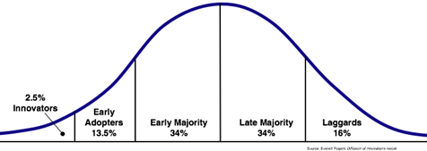

This post is going to explain the importance of your product reaching critical mass. When I say "product", I mean an actual product you're selling, or simply a website or blog. When I'm talking about critical mass, I'm describing the point at which your product becomes viral, sometimes known as the [network effect](http://en.wikipedia.org/wiki/Network_effect). This should be a lesson to anyone thinking of creating their own product or service.

Above, you'll see the typical [technology adoption bell curve](http://en.wikipedia.org/wiki/Technology_Adoption_LifeCycle). What you need to realize is that you're starting on the left, and you're trying to get up the hill. Do you think it's easy? Well, judging by Youtube, twitter, [milliondollarhomepage](http://www.milliondollarhomepage.com/), Digg, or myspace, it must be easy!

The truth is, you should have a path to success. Here are just a couple of paths that have worked for other products:

*   Create a product that is leaps and bounds better than anything your potential customers have ever seen - An example is Google, which was originally created by students in college. The brilliance of the algorithm and its implementation were the start of a massive company.
*   Have an army of followers that listen to your advice - A great example is Steve Jobs. Before he even makes a new product announcement, people line up at Apple stores. People trust that he'll make cool stuff, so they listen to whatever he says. You can bet that if Steve Jobs mentioned your product, you would people lining up at your door to buy it.
*   Get lucky - It happens time and time again. Multiple products are released at the same time, all with similar features and price. Sometimes one of them gets lucky, and the others die. An example is the VHS vs Betamax format war. VHS was considered the inferior product, yet it went on to become the de facto standard.
*   Create a product that is viral by nature - Twitter and Myspace come to mind. Once one person joins, they're begging their friends to use if. If they don't, the service is useless. The result is that you get an army of free advertisers talk to your key demographic.
*   Spend a ridiculous amount of cash to bombard users with advertising - infomercial's and those annoying "[we'll double the offer](http://www.poop-freeze.com)" commercials come to mind.
Hopefully I'm making the situation look difficult. I couldn't find any concrete numbers, but you can be sure that more than half of online businesses fail within the first couple of years. That includes well-funded businesses. If you expect to start the next [Fog Creek Software](http://www.fogcreek.com/) while working part time in the evenings, you need to have a plan.

The best advice I can give you is to do whatever it takes to get your product into the hands of as many people as possible. It might mean making partnerships with someone of influence, or it might mean creating a viral marketing campaign. It might also mean that you'll have to give your product away for free, build up your army of followers, and then invent another great product. If you already have a product with a good user base, you're probably already in good shape. If you are just starting out, don't think that people will magically find you, unless you're counting on the "lucky" path I described.