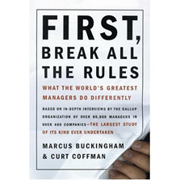

I've a read a lot of articles talking about [what it takes to be a good development manager](http://www.aaronlerch.com/blog/2008/04/20/from-developer-to-technical-manager/). There are also articles about [what makes a good developer](http://www.ytechie.com/2008/04/why-im-a-better-software-developer-than-you/). I thought it would be a good idea to describe what a developer needs from their manager.

 

[**A developer abstraction layer**](http://www.joelonsoftware.com/articles/DevelopmentAbstraction.html) - There is so much stuff that goes on in a company, and I really don't need to know it all. For my own curiosity, give me general interesting tidbits, but more isn't necessary. 

**Leave me alone** - If you interrupt me for no reason while I'm getting a lot of work done, I'll obviously get less done. It's not worth interrupting me just to find out what I'm doing. If I'm walking around, that's probably the best time to talk to me. 

[**Buy any training materials that I request**](http://amazon.com/o/ASIN//ytechie-20) - Books are cheap compared to my salary. If I can learn something new that will save time, the investment will have been worth it. The same goes for magazines, software conferences, etc.

**Be flexible** - When it's time to get some coding done, there are times that I'll be more productive than others. My computer doesn't care if I'm using it at 3AM or 10AM. You shouldn't either.

**Trust** - If you don't trust me, you're setting me up for failure. Trust your employees first, and take appropriate action if they give you reason not to trust them. If I know you trust me, I can focus on getting my job done.

**Keep me happy** - A happy developer is a productive developer. Sometimes there are small things you can do that will keep me happy. Buy lunch every once and a while. Tell me to go home early on a Friday. As a bonus, I won't be looking for another place to work if I'm happy.

**Guide, but don't over-manage** - You have the big picture, so I need your guidance. That doesn't mean that you have to know every detail about what I'm doing. You're not a babysitter, you're a teammate.

**Be accessible** - If I get need something, please be available. I may need you to pull in the right resources to solve a problem.

**Have answers** - You're the hub of the wheel. If you don't know what's going on, you're useless to me. You need to be organized and connected.

**Be able to prioritize** - You have a better idea of what is important for the overall product. That means I need you to prioritize features accordingly. That means I'll always be working on something important.

**Tell me what is expected of me** - I need to know exactly what is expected of me, and I need to know how you'll determine if I'm completing what is expected. I also need to know how you're going to gauge my performance. When it's time for my review, there should be no surprises.

If you're interested in more information on this topic, I highly recommend you read "[First, Break all the Rules - What the world's greatest managers do differently](http://www.amazon.com/First-Break-All-Rules-Differently/dp/0684852861/ytechie-20)". It's not specific to development managers, but it certainly applies. In that book, they empirically determined the factors that are the most important traits that promote success and happiness:

 

1.  Do I know what is expected of me at work?
2.  Do I have the materials and equipment I need to do my work right?
3.  At work, do I have the opportunity to do what I do best every day?
4.  In the last seven days, have I received recognition or praise for good work?
5.  Does my supervisor, or someone at work, seem to care about me as a person?
6.  Is there someone at work who encourages my development?
7.  At work, do my opinions seem to count?
8.  Does the mission/purpose of my company make me feel like my work is important?
9.  Are my co-workers committed to doing quality work?
10.  Do I have a best friend at work?
11.  In the last six months, have I talked with someone about my progress?
12.  At work, have I had the opportunities to learn and grow?  

That book is one of my favorites, and I highly recommend all managers read it.

Are there any other factors you feel are important? Leave a comment and let me know!