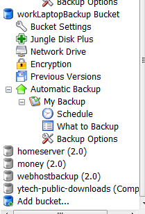
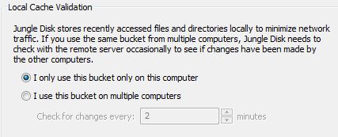
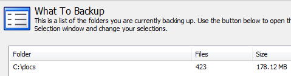
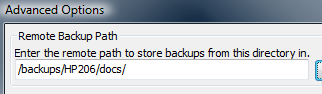
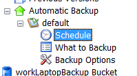
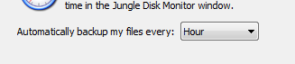
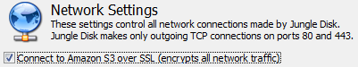
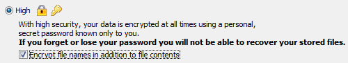
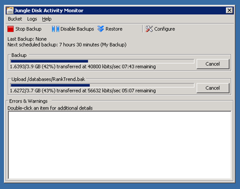

I've settled on a new backup solution. I'm going to be using [Amazon's persistent storage solution called S3](http://www.amazon.com/gp/browse.html?node=16427261). Amazon provides a **virtually infinite, scalable storage** cloud that allows you to store files indefinitely. You pay a small fee to get the data there ($.10/gig), a fee to store the data ($.15/gig/month), and a fee to retrieve the data ($.17/gig).

Features I was looking for:

*   Reasonably Priced
*   Automatic
*   Reliable
*   Scalable
*   Well performing
*   Easy  

### Price

To automate my backups, I'm using a product called [JungleDisk](http://www.jungledisk.com/). You can purchase it for $20, and you get free upgrades for life. I love products that have free upgrades for life, since I don't have to worry about _when_ buy it. They also allow you to use it on unlimited computers, which I definitely need.

JungleDisk by default talks directly with S3, so they don't need to run any servers. You're counting 100% on the reliable storage provided by S3.

### Organization

Amazon stores your files in &quot;buckets&quot;, which you can think of as a single level folder/directory structure. JungleDisk can easily connect to multiple buckets at the same time. You configure each bucket independently. JungleDisk can automatically detect all of your buckets, and you can easily create new ones.

 

I highly recommend creating buckets for each logical group of files you want to back up. Try to avoid sharing a bucket between computers when possible. If you tell JungleDisk that a bucket is only used on one computer, it doesn't have to query S3 to determine what needs to be synchronized. The default is set to **multiple computers**. This setting is under the &quot;Bucket Settings&quot; for each bucket.

 

Each bucket also lets you choose what to back up. Of course there are extensive options for backing up subfolders, excluding files, etc.

You can even set up how your local folders get mapped to the remote folders. This lets you do multiple folders in one bucket. On my laptop, I have a couple of folders that get backed up to a single bucket, but are organized into different folders so that I could easily restore them independently.

 

### Scheduling

Setting up a schedule is very easy. For example, on my laptop, I have it set to synchronize my files every hour. It uses the timestamp's of the files to determine if there are any new, changed, or deleted files. Since I'm not sharing this particular bucket between machines, it can _instantly_ determine if anything needs backed up.

 

 

### Security

JungleDisk has all the security options you would expect. You can communicate with Amazon over port 80 unencrypted, or use SSL. I actually turn off the SSL option, because I use the JungleDisk encryption. I don't see a reason to do double encryption.

When you create the bucket, you can specify a custom key that encrypts your data. I like this option because I am the only one that has access to the data. Even Amazon can't tell what I'm storing on there.

 

### Performance

Since Amazon is providing the storage, they're able to scale indefinitely. You can be confident that they can handle whatever you throw at them. They had no problem letting me upload at over 56,000 kbits/sec from my dedicated host. I backed up 4 gigs in about 10 minutes.

 

### Other Features

*   **Bandwidth limiting** - If you don't want to use up all of your upstream or downstream bandwidth, you can limit it, and even schedule when it's limited. This could be useful for limiting the connection during the day. However, I much prefer a QoS solution since it will maximize the amount of bandwidth I can use.
*   **Previous versions** - There are extensive options for storing previous versions of changed or deleted files. This option is very impressive, and great for documents.
*   **Network drive** - You can make a bucket show up as a drive on your computer, which allows you to drag and drop files to and from the bucket.
*   **Jungle Disk Plus** - For $1/month extra, you can get JungleDisk Plus. They use an Amazon EC2 server to proxy your data to S3\. This allows you to resume large file uploads, and also lets you send just the differences. If you're backing up large files and/or files that may have sections change frequently, this could end up saving you money.