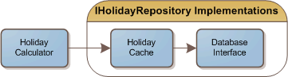

I've been really trying to use the [Single Responsibility Pattern](http://www.ytechie.com/2008/06/agile-patterns-practices-and-the-developer-divide.html) in all of the classes I design. Recently, I needed to create code to query a list of holidays from the database, and then create a method that allows you to get the number of holidays between two given dates.

Here was my first stab at the constructor:
 
	public HolidayCalculator(IEnumerable<DateTime> holidays)

It's simple and easy to understand. Then I started thinking about some of the dependency injected examples I've seen. For example, [one of the Spring.NET IoC quickstarts](http://www.springframework.net/doc-latest/reference/html/quickstarts.html) has a similar example, except that they're trying to list movies. In their example, they use an IMovieFinder interface. That interface has a single method that retrieves a list of movies. Using this concept, my constructor would look like (and what I ultimately changed it to):

	public HolidayCalculator(IHolidayRepository holidayRepository)

That example originally seemed unnecessarily complex to me. Why separate something so simple and disconnected into an interface? Well, it turns out there are a couple of good reasons that you might want to do this.

### Delay loading

With my original constructor, I had to load all of the holidays from the repository (ultimately a database in the production environment) to even create an instance of this class. This is certainly less than ideal when I want to use this class as a singleton that may get created early in the application.

### Single Responsibility

In my original design, I was accepting in a list that would get cached in my holiday calculator. My class now has two responsibilities. It has to calculate holidays, and it has to cache the holiday list. What if I wanted to change how the list was cached? I would have to change the class, which is not ideal.

Ideally, this class would load the holiday list each time it needs to perform a calculation. The implementation passed into the constructor would be responsible for caching. In fact, we can now easily separate out the caching feature, and the holiday loading feature. Both classes would implement the IHolidayRepository interface and would be chained together. The caching class would take an IHolidayRepository.

### Incremental Coding

Following the Agile philosophy, I can now deliver code faster. I don't _need_ to add a caching layer. I can have a working application in less time, and then later evaluate if I need to cache the holiday data.

### Conclusion

Overall, this design is a little more work, but I think the benefits outweigh the extra classes and interface I needed to create. This design makes it easy to test, and each class has almost no code in it. Reading it and understanding it is extremely simple.