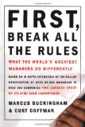

I've read books about what makes employees happy. If you manage people, I recommend reading the book [First, Break all the rules - What the world's greatest managers do differently](http://www.amazon.com/exec/obidos/ASIN/0684852861/ytechie-20). In that book, they surveyed tends of thousands of the best managers and employees. In their extensive research, they were able to come up with the 12 most important factors that make employees happy, increase productivity, and decrease turn-over.

1.  Do I know what is expected of me at work?
2.  Do I have the materials and equipment I need to do my work right?
3.  At work, do I have the opportunity to do what I do best every day?
4.  In the last seven days, have I received recognition or praise for good work?
5.  Does my supervisor, or someone at work, seem to care about me as a person?
6.  Is there someone at work who encourages my development?
7.  At work, do my opinions seem to count?
8.  Does the mission/purpose of my company make me feel like my work is important?
8.  Are my co-workers committed to doing quality work?
9.  Do I have a best friend at work?
10.  In the last six months, have I talked with someone about my progress?
11.  At work, have I had the opportunities to learn and grow?  

A major point of the book is that managers are able to read employees, and treat each of them in a way that makes them happy and productive. That may mean that one person gets 5 monitors, and another gets an [Optimus keyboard](http://www.artlebedev.com/everything/optimus/). Another employee may have to move into the basement, and give up their red stapler.

My opinion is that **managers work for their employees**. It's the managers job to make sure the employees are productive, and to provide the right environment. If they can't do that, they shouldn't be a manager.

Lately, I've began wondering why managers don't ask each employee this simple question:

**"What do you need from me?"**

If you're manager doesn't ask this, are they just guessing? In some cases the answers may not be incredibly useful, but in most cases you could learn a lot from the answer. For example, someone might say they need it to be quiet, and another might say they need a lot of background noise. A person might say that they need flexible hours or more desk space.

If you don't ask that question, you may never know the answer. If you're lucky, you'll eventually be able to figure it out, but can you afford to take that chance?

If your manager doesn't ask this question, why don't you answer it anyway? Even if it doesn't help your manager, it will certainly help you understand what you need to accomplish your goals. You may be able to find more creative ways to help your manager understand what you need to get your job done.