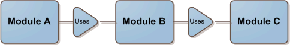

I'm going to describe a methodology that will help you save time by writing better classes, and will help simplify your life by allowing you to solve problems with a top-down approach.

Developers such as myself often have a tendency to just focus on the class we're currently working on. Of course I believe [this is a good thing](http://www.ytechie.com/2008/07/programming-for-someone-with-blinders.html), because we all know [the importance of focus](http://www.ytechie.com/2008/05/focus-is-the-key-to-success.html). However, you should never forget the reason you're actually writing that class. It is because **other code will be consuming it**.

 

There have been far too many instances where I would figure out which pieces I needed to build, and then build each one, from the bottom up. The problem is that I would write the class in the most short-sighted and **easiest** way possible, which is usually not the best way to use it.

Now, when there is a question of what a class interface should look like, I ask myself what it _should_ look like to make the life of the consumer as easy as possible.

Sometimes we can even take code usability to an extreme. For example, [Fluent interfaces](http://en.wikipedia.org/wiki/Fluent_interface), which allow you to chain together multiple calls. In many instances, this makes the code much easier to _call_, potentially at the expense of making the _called_ code more complicated.

I've come up with a simple example to help illustrate. Suppose I need to process a list of x,y coordinates. Here are a couple of potential signatures:

*   ProcessData(double[] xData, double[] yData);
*   ProcessData(PointF[] points);
*   ProcessData(IDictionary<double, double> points); 

For now, just ignore the performance implications ([they're going to be linear in this case](http://en.wikipedia.org/wiki/Big_O_notation#Orders_of_common_functions), or close to it anyway). To choose the correct signature, we need to know who the caller is.

Of course there is a good chance that we'll have a slight intentional leaky abstraction. In the previous example, we may have been able to use the [IEnumerable generic](http://msdn.microsoft.com/en-us/library/9eekhta0.aspx) to be more flexible. That's a topic for another day.

Thankfully, this problem is minimized, although not always eliminated when you follow the [single responsibility principle](http://en.wikipedia.org/wiki/Single_responsibility_principle). The better you can follow that principle, the simpler each piece will be. That tends to minimize the potential for the consumer to need the interface to look different than it would naturally be.

Another way to look at your classes from the consumers point of view is to practice test-driven development. In fact, I see this as one of the strongest arguments for test driven design. For each layer in your code, you're creating code by consuming it before writing it. Every layer acts as an API to the layer above it.

In conclusion, I'm simply recommending that you don't lose sight of **why** you're writing that piece of code. You're not just writing code for the sake of writing code, you're writing it to be used!