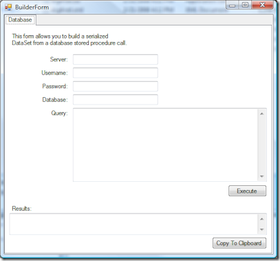

[As I've mentioned before](http://www.ytechie.com/2008/04/net-xml-dataset-generator-from-a-sql-query.html), I [wrote a small utility](http://code.google.com/p/queryxmldataset/) for running a SQL query, and returning the results as an XML serilialized DataSet.

I created a quick screencast to demonstrate how you go about using this utility. I'm new to screencasts, so don't expect a high production value!

 

**[You can check out the screencast here!](http://s3.ytechie.com/screencasts/QueryXmlDataSet-Screencast/QueryXmlDataSet-Screencast.htm)**

Let me know what you think in the comments!