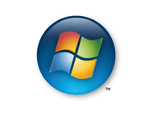
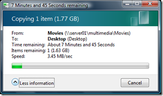
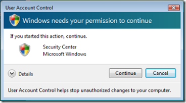

I know that Microsoft doesn't need anyone defending them, but I think that the series of events surrounding Vista were certainly not ideal. I've highly anticipated every new release of Windows, and Vista was no exception.

 

Watching the progress of Vista, I couldn't help being disappointed. Vista was supposed to change the world. There would be an amazing new file system, a cutting edge graphics system, and .NET driving many of the core functionality. But one by one, the features got neutered or disappeared completely.

When it was released, the bad hype had already nearly killed it for me. Then I installed it in a virtual machine and learned what a pile of crap it really was. It took minutes to boot, and the UI was barely usable. Every few seconds I would get security prompts. I was done with this OS for a long time.

Fast forward to Windows 2008\. I started reading great things about how this OS made a great desktop OS. At the core, it's Vista SP1, but with much of the crap removed. I tried it out, and loved it. I had a few issues with incompatible drivers, but that's expected when using a just-released 64-bit OS.

Then, Vista SP1 was released, and most of the cynics said it was &quot;decent&quot;. Time had helped fix the driver issues, and SP1 addressed specific pain points. Eventually I got around to installing Vista SP1 (64 bit) over Windows 2008\. I was amazed. Nearly all of the drivers were already included. It was fast, and some of the new features, while not life changers, were a boost to my productivity none-the-less.

Recently, I purchased a new laptop. It's shocking what you can get for a mere $650\. It's a 14.1&quot; HP (dv2910us) with 3GB RAM, 2GHz Core 2 Duo, 250GB hard drive, 802.11n, DVD burner, and even a built-in removable remote control. Of course it included a license for Vista. HP includes a shocking amount of crapware, so I reinstalled Vista from my MSDN media. One major improvement over XP is that your OEM key works with MSDN media. That means I can actually use the key that was on the sticker of the laptop! Thank you Microsoft (and it's about time)!

It runs great on my laptop, and I've had no complaints whatsoever. In fact, I think I've had less issues than if I was running XP. Much to my surprise, a few days ago I get a prompt to install updates. **The update in the list was SP1.** Yes, that's right, I wasn't even using SP1\. Maybe Vista was bad when it came out, but I think the horsepower of modern computers combined with finally decent driver support erases the bad history.

I'll sum up what I love about Vista over XP in one paragraph. Integrated search from the start menu rocks, and I use it **constantly**. I also love the new copy dialog, which tells me the actual speed of file transfers. As far as 64-bit support, I've been very impressed. It's very possible to run the 64-bit version and have a decent change of all of your devices working as expected. This is a must since typical new high-end computers are going to start going over 4GB RAM soon (if they haven't already). There are even hard to find features that are very nice. When you copy a folder over another folder, it actually gives you a reasonable set of options, as well as enough information to make a decision about merging, overwriting, or even renaming them.

Now what about UAC? You know, the feature that pops up an annoying dialog every 5 seconds? Well, if you run your computer as a local administrator (like you did in XP), you'll rarely see them. I actually appreciate them because it does make your computer safer.

**Conclusion**

Make up your own opinion about Vista and give it a try. It's mature enough that I recommend it to my tech friends. I was just as apprehensive as everyone else, but I'm glad I made the switch. In case you're wondering, no Microsoft hasn't paid me, but it sure would be nice :-).