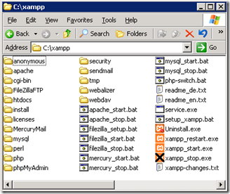

This site and a couple others are served up on a dedicated server. To make it easy to set up Wordpress, I'm using XAMPP. In this post, I'll give a quick overview of XAMPP, and then also show you how to secure it so that administrative utilities are only available locally.

**XAMPP Super-Quick Overview**

XAMPP is basically a quick way of setting up MySQL, PHP, Perl, and Apache. You can download it, extract it, and run it from any location. If you're not experienced Apache/PHP world, this is the easiest way to get something working ASAP. In the next image, you'll see the directory structure under your XAMPP directory:

 

Here are the key folders you would probably need to worry about:

*   **apache** - Contains the installation of Apache.
*   **htdocs** - Contains the folder that is served up by Apache. If you want to install a web application such as Wordpress, you probably want it in here.
*   **mysql** - Contains the installation of MySql. 

Now, if you simply want to install Wordpress on XAMPP, I'm not going to write yet another tutorial. There are plenty out there, most with screenshots of step-by-step instructions, [just Google for them](http://www.google.com/search?q=xampp+wordpress).

**Securing XAMPP**

Once I configured XAMPP, I stupidly assumed that the utility applications like phpmyadmin would not be publicly available. I was very wrong, and was warned before anyone decided to do something bad.

Most of the instructions I found through Google for securing the utility paths seemed kind of weak to me. They basically work by securing those paths with a password. I'm a little paranoid, so I don't want those paths remotely accessible _at all_.

The first thing I did was lock down Apache security so that it's very restrictive by default (apache/httpd.conf):

 
<pre name="code" class="xml"><Directory />
    Options Indexes FollowSymLinks Includes ExecCGI
    AllowOverride All
    Order deny,allow
    Deny from all
&lt;/Directory&gt;</pre>

Make sure that you don't have any other directory directives in your configuration file that may override this.

Next, in the .htaccess file for each Wordpress installation, I added this line: "Allow from all". This basically tells Apache that this folder is safe to serve up to everyone.

Now, the problem is that XAMPP has a configuration file that overrides the utility paths and allows access for anyone. To fix this, perform a search and replace in the (in Apache/Conf/Extra) "httpd-xampp.conf" file to change "Allow from all" to "Allow from 127.0.0.1". Now, all of the XAMPP directories will only be served locally.

**Conclusion**

My background is certainly not Apache/PHP, but I'm still learning. If I made any mistakes in my configuration, please leave a comment or send me an email.