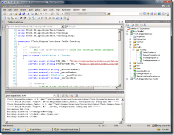

If you haven't heard, Amazon's EC2 service provides cloud-hosted virtual machines. Initially, they just supported Linux machine images, but recently have allowed Windows machine images. This means that you can create on-demand hosted virtual machines accessible from anywhere.

 

I decided to do some simple, informal performance testing. To do **development** performance testing, I like to run a build process and time it, since compiling is typically the bottleneck on a development machine (other than the IDE and the developer).

I downloaded the source code for [SharpDevelop](http://www.icsharpcode.net/OpenSource/SD/), since I knew it would be a fairly large, yet automated build process. The only thing I needed to install was .NET 3.5 SP1\. As a baseline, I ran the build on my personal laptop, with these specs: 2.0GHz Core 2 Duo, 3GB RAM, 250GB 5400RPM hard drive. To test the performance of the build, I ran it once, ran a "clean" operation, then ran the build a second time, timing it only on the second run.

*   My laptop:&nbsp; 1 minute, 37 seconds*   EC2 Small Instance: 2 minutes*   EC2 Medium Instance: 41 seconds 

As you can see, the EC2 "medium" instance, was over twice as fast as my local machine.

To continue my testing, I installed Visual Studio 2008 Professional, ReSharper, TortoiseSVN, and the Silverlight toolkit. My initial impression was very positive, and I could certainly see myself using it on a regular basis. From a professional standpoint, I would probably prefer a dedicated development machine. However, **for an occasional hobby development environment, this might be a viable alternative**.

EC2 has many advantages over running [VMware](http://www.vmware.com) or [Virtual PC](http://en.wikipedia.org/wiki/Microsoft_Virtual_PC) on your own computer:

*   Can take snapshots of drives*   Doesn't use resources from your computer*   CPU can be upgraded/downgraded as needed*   Theoretically ultra-stable host*   Very fast Internet connection (I downloaded 800mb in less than 30s!)*   Theoretically updated virtual hardware as time goes on*   Potentially faster (especially if you use a laptop) 

However, there are a few obvious disadvantages:

*   Pay-per-hour can get expensive if you use it full-time*   Can't drag and drop in and out of the VM like desktop virtualization can*   Need to remote connect using something like remote desktop so graphics performance isn't the best*   Only available when you have access to the Internet*   Not necessarily great multi-monitor support*   Virtual machines take a while to start and snapshot 

**Pricing**

Right now, Windows based machines are priced starting at $.15/hr (medium for $.30/hr). For a machine that runs 24/7, this can get expensive compared to dedicated hosting. However, for a machine that's used for only a couple of hours each day, the pricing is very reasonable.

As an example, if you run a medium instance machine for 8 hours/day, 20 business days/month, you'll end up paying $48/month.

**Conclusion**

Having virtual, dedicated computers available on-demand for pennies per hour is very exciting. [This is half of the cloud computing equation](http://www.ytechie.com/2008/11/cloud-computing-and-azure-right-for-your-site.html), and I believe it's going to be an important _part_ of the future of the web.