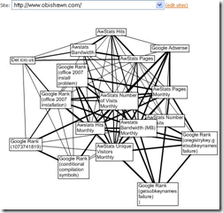
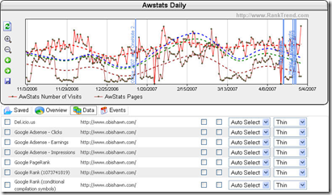
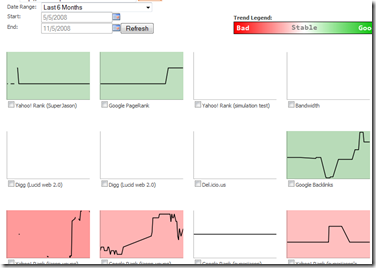

[In my last post](http://www.ytechie.com/2008/11/rip-naturallinkexchangecom-lessons-learned.html), I started talking about two sites that I'm shutting down. Today I'm talking about the history RankTrend.com, and the lessons I learned.

&nbsp;

RankTrend.com was an idea and a vision that I had while we were working on NaturalLinkExchange.com. It was designed to help people who were trying to optimize their sites for search engines, but didn't really have any insight into what was actually working. Here were the goals:

*   Track metrics about your site including your current rank in search engines, PageRank, AdSense income, advertising costs, visitors, etc. This data would be tracked daily, or even more often depending on the type of data.*   Track metrics using a client application the user installs so that the requests came from their computer and not our server.*   Import any other metrics from other services such as AwStats.*   Track events so that changes in the tracked metrics could possibly be attributed to those events.*   Data-mining would allow us to transform the data into meaningful information using charts, statistical analysis reports, and correlation diagrams. You could actually answer a question like "Which search engine can turn my advertising dollars into the most profit?".*   Provide notifications when certain thresholds were met. For example, I want to know when my PageRank changes, or when my site drops in the search engines. 

We were successful in building a generic system that met most of the goals. From the beginning, the system was set up to be extremely generic so that any type of data could be tracked and stored.

Here is a screenshot of the correlation diagram. This is kind of an extreme example, but it shows which items were correlated with other items. The wider the line, the stronger the correlation.

This is a neat report because of the algorithms it uses. The standard correlation formula is used to determine the correlation coefficient. For laying out the diagram, it uses a [force based algorithm](http://en.wikipedia.org/wiki/Force-based_algorithms) by simulating the edges being springs (using Hooke's law), and the nodes are electrically charged particles (Coulomb's law). It was very fun project.

 

Here is a screenshot of the main report. As you can see, there are vertical lines that represent events (in this case they were actually blog posts). From this data, you're able to see the effect of a blog post on your visitors and other metrics. The wavy lines help stabilize the day to day changes in the data.

 

Here is a screenshot of the thumbnail dashboard. This report provided a quick way to glance over every metric you were tracking for a site. The background was color coded to the trend of the data. If the data was improving, it would be a darker green based on the amount of improvement. Red indicated that the value was getting worse.

The charts were actually using the [Google charting API](http://code.google.com/apis/chart/), which provided a great way to generate a lot of charts very quickly, and without increasing server load for us.

 

Once you got past the initial setup and started getting data, the service was admittedly very awesome. Many of the features should be adopted by Google Analytics, and some already have been rolled out in their latest update. The biggest problem is that Google doesn't integrate the position of your keywords with the other data.

**Lessons Learned**

This is the important part, because it's all that remains from the site. I learned an incredible amount while building this site, so I'll share it with you.

The main reason we had another failed site (depending on your definition of "failure"), was because we were not able to reach critical mass. We simply didn't have an army of followers that we could use as our initial beta testers. If you're starting a new website, this should be your top concern! The best site will go nowhere if nobody knows about it.

*   **A simple UI usually means more code**. When designing how the user would configure their datasources, I designed it so that it made the most sense from a technical standpoint. However, it didn't make sense from a user standpoint. If I had to design it again, it would be much simpler to the user, but would take a lot more code. Nobody said a good design was easy.*   **Simplicity wins**. The site had a competitor that only had a fraction of the features, and even had users pleading for new ones. Even though we seemly filled the need, the users didn't come over in a mass exodus as expected.*   **Don't do more than you need, focus on the core design**. The first iteration of the site had over a dozen options on the control panel for logged in users. In hindsight, they must have been very confused. This is part of keeping your UI simple, but it's also a matter of making the common parts easy to find, and the advanced features hidden. The power users will usually find them.*   **Don't compete with the big guys**. Our site came out at a time when Google Analytics was still in beta. Guess who you saw in the headlines? I'm still frustrated to this day about some of the features Google Analytics is blatantly missing, but they have nothing to worry about. When you're giving away a "good enough" product for free, it takes a miracle to compete with that. If we had been able to find a hidden niche, maybe we could have gotten the ball rolling, but that just wasn't the case. 

**Conclusion**

This was another fun project that I will never regret working on. This was my first project using NHibernate, so it was a great learning experience. It also gave me a chance to try out the Google charting API, as well as a third party charting control called [ChartDirector](http://www.advsofteng.com/). This is a tough one to let go, but I want to make sure that I do a better job focusing my time instead of diluting it between many projects.