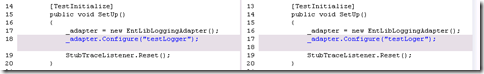

I recently spent nearly an hour trying to figure out why all of my unit tests stopped working in a particular class. It turns out that I had accidentally deleted a single character in one of my strings, but the built in diff tool that comes with Team Foundation Server is very simplistic. Learn how and why you can replace your stock compare tool with something a little more powerful.

Here is a screenshot of what you'll see in the stock Team Foundation Server compare tool:

 

See how hard it is to spot the difference? The problem is, ANY change on the entire line causes it to show up as "changed". That includes whitespace changes. For this reason, I frequently end up with extra full lines that are colored as having been changed, making it harder to see the actual code changes. For the most part, I really don't care about whitespace changes because they deal with the formatting of the document, and I'm more concerned with functional changes to my code.

The good news is that those smart guys at Microsoft make it easy to integrate a third party compare tool right into their tools. James Manning was even kind enough to include [detailed instructions and the exact settings needed](http://blogs.msdn.com/jmanning/articles/535573.aspx) for every major compare tool. You can even use them for merging if you like.

Since my background is in Subversion and TortoiseSVN specifically, I pulled out my trusty [KDiff3](http://kdiff3.sourceforge.net/) (SourceForge) compare tool. It's a common alternative for TortoiseSVN's own diff tool.

After wiring up KDiff3, here is what I saw when I compared revisions:

 

Notice how easy it is to see that I changed a single letter (it's obviously easier when it's full-size).

There are other good reasons to use a third party compare tool (which vary by tool obviously):

* Easily compare entire file structures (folder diff)
* Inline editing
* Easy to use outside of Visual Studio - often with an explorer context menu 

I recommend giving a few of the compare tools a try and see which works best for you. I don't really see any risk in using a third party compare tool, but there are certainly a lot of advantages that you may not even know you're missing right now. I suggest also taking a look at [WinMerge](http://winmerge.org/) in addition to [KDiff3](http://kdiff3.sourceforge.net/), since it seems to be fairly popular and feature-rich as well.