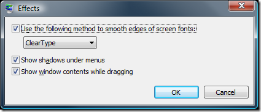
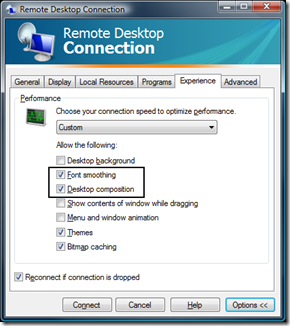

A new feature in XP SP3 that should of particular interest to developers is ClearType over RDP (remote desktop protocol). If you occasionally use remote desktop to work from home, or work remotely to your development machine, please read on.

If you're not familiar with ClearType, you can head over to Wikipedia for a [full explanation](http://en.wikipedia.org/wiki/ClearType). In a nutshell, it takes advantage of the fact that each pixel in an LCD screen actually has 3 sub-pixels. They can be "hacked" to improve the anti-aliasing of text displayed on the screen. I've been a huge fan of the feature, especially for source code, and I have a hard time living without it. In XP (locally), it's turned **off** by default, but turned **on** in Vista.

 

I had always noticed the remote desktop would not give me ClearType. However, I became curious when I found the following options on my Vista machine. Apparently ClearType over RDP is now supported in the client, and is also supported when using Vista as the RDP server (no hacking needed).

 

Unfortunately, these options have no effect when using XP. If you want ClearType over RDP with XP SP3 (sorry, only SP3+), add the following registry key:

 
<pre name="code" class="c">Windows Registry Editor Version 5.00

[HKEY_LOCAL_MACHINESYSTEMCurrentControlSetControlTerminal ServerWinStations]
"AllowFontAntiAlias"=dword:00000001</pre>

After you add that registry key, simply reboot the server (XP), and reconnect. From what I can tell, the client options no longer matter. Even if I uncheck the "Font Smoothing" option, it still uses ClearType. It's not a big deal, but I thought it was worth mentioning.

So far, after using this option for a while, I haven't seen a significant performance impact over a VPN on the Internet.

If you want to take this a step further, install [Consolas](http://www.microsoft.com/downloads/details.aspx?familyid=22e69ae4-7e40-4807-8a86-b3d36fab68d3&amp;displaylang=en), it's a font designed specifically for software development, and to take advantage of ClearType. It's a free download from Microsoft.