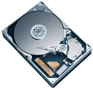
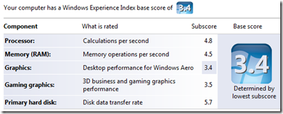

My laptop came factory equipped with a 250GB 5400RPM hard drive. Overall, the performance has been pretty good. One of the only areas that has been less than spectacular was virtual machine performance. I placed an order for a 320GB 7200RPM laptop drive. Was it faster? Read on to find out!

 

**Old drive:** [Seagate Momentus 5400.4](http://www.newegg.com/Product/Product.aspx?Item=N82E16822148310) - 250GB 5400RPM 8MB Cache SATA
**New Drive:** [Hitachi Travelstar 7K320](http://www.newegg.com/Product/Product.aspx?Item=N82E16822145228) - 320GB 7200RPM 16MB Cache SATA

Before I upgraded to the bigger, faster drive, I took a few quick benchmarks. It booted in 57 seconds from pressing power to being able to type my password. I was able to build SharpDevelop in 29 seconds, and my XP performance rating was 5.6.

The upgrade process was fairly painless, but I have a fairly good background in computer hardware and imaging (as do many of my readers I'm sure). I created a disk image with Acronis TrueImage (equivalent to Norton Ghost), and wrote that image to the new drive. Since I had about 70 extra gigabytes on the new drive, I allocated that as a second partition. I figured that I would use that extra partition for my virtual machines (typically a good practice).

I was back up and running in less than 2 hours.

Unfortunately, I was fairly disappointed. I was expecting a reasonable boost in performance but was let down. My HD performance rating went from 5.6 to 5.7, but my other benchmarks actually **got worse**. I'm not convinced that the HD actually made the performance worse, but some part of the upgrade process must have had an ill effect, or my benchmarking process just wasn't very scientific.

 

Stat summary (obviously unscientific):
 <table cellspacing="0" cellpadding="2" width="355" border="0"> <tbody> <tr> <td valign="top" width="164"></td> <td valign="top" width="88">**5400RPM**</td> <td valign="top" width="101">**7200RPM**</td></tr> <tr> <td valign="top" width="163">**SharpDevelop Build**</td> <td valign="top" width="88">29 seconds</td> <td valign="top" width="101">30 seconds</td></tr> <tr> <td valign="top" width="162">**Cold boot**</td> <td valign="top" width="88">57 seconds</td> <td valign="top" width="101">74 seconds</td></tr> <tr> <td valign="top" width="162">**Experience Index**</td> <td valign="top" width="88">5.6</td> <td valign="top" width="101">5.7</td></tr></tbody></table> 

**Conclusion**

If I had it all to do over again, I wouldn't buy the faster drive. It just wasn't worth $100 (it's $80 after rebate now). If my drive was slower, older, or smaller, it may have been worth it. Fortunately, the new drive is just as quiet as the old one, and I've noticed no power usage difference. At the very least, it gave me an opportunity to dedicate a partition to my virtual machines.