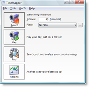
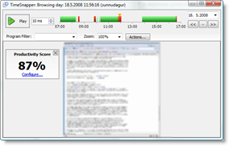
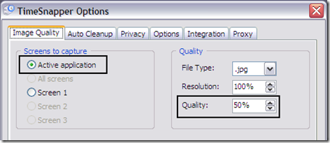
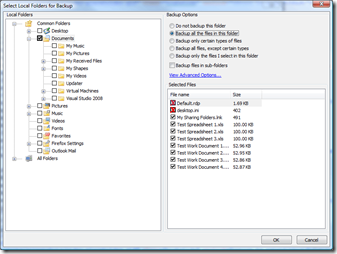

Inevitably, you'll lose power to your computer, have a hard drive crash, have lightening strike, accidentally delete code that hasn't been checked in, or encounter some other crazy scenario that I can't even imagine. What is your plan? Read on if you want some solutions that may just save your <strike>ass</strike> code.

 

I've had it happen to me, I accidentally deleted hours of work and had to spend the time to rewrite the code. I even remember a time while working at my first job that the power went out to our whole building. At the time, most computers were desktop machines without a UPS. It was seconds after the lights went out that I heard an agonizing moan from one of the offices. Another developer hadn't saved often enough and lost everything he was working on.

**Use a automated screenshot tool**

For the past few months, I've been using a product called [TimeSnapper](http://www.timesnapper.com/). Basically, it takes a screenshot of your desktop every few seconds. I have mine set up to the default of taking a snapshot every 10 seconds.

  

You can store the screenshots as standard image files such as PNG or JPG. You can optionally encrypt the images so that they can only be viewed with the correct encryption key.

Usually one of the first concerns with this backup method is that the image files take up a fair amount of space. Luckily, there are a few ways to optimize the screenshots. Below are the options that I use personally. I use a high level of compression for the images, and only capture the window that has focus. These settings work well with my goal of being able to read the code that was displayed on my screen at any given time.

 

I honestly can't recommend this product enough. It's well worth the $25 price tag. Its not only saved me from losing valuable code, but I've even used it to lookup information that I found on the web but can't relocate.

Here is partial list of features to get you salivating:

*   Play your day back like a movie - Watch your entire day in minutes, or quickly scan a time range to find code that may have been deleted.
*   Track productivity by telling it which programs should count as "productive".
*   View reports on how long each type of application is used. Not necessarily useful, but interesting nonetheless.
*   Flag sections to associate them with other items such as work items in a bug tracking system.
*   Filter by application - You can configure it to track only Visual Studio for example. 

**Use a keylogger**

The next option has the advantage of being a little more lightweight, but may not offer the same level of code protection as using a screenshot tool. Basically, you install a keylogger that will record every keystroke that you make.

When I first had the idea to use a keylogger, I discovered that there are a number of legitimate keyloggers out there. Apparently, book authors frequently use keyloggers to save their work.

You have two options for the type of keylogger you can use. You can use a [hardware solution](http://www.keyghost.com/USB-Keylogger.htm) that plugs into your computer on one end, and the mouse plugs into the other. The other option is to use a software keylogger such as [PyKeylogger](http://sourceforge.net/projects/pykeylogger/) (open source, free).

The biggest problem with keyloggers is that they store the information as you originally typed it, not as it is in your code files. That means that if you're jumping between files, or making a lot of edits or corrections, the key log won't be of much use to you.

Most keyloggers do allow you to encrypt the recorded information so that your passwords and other sensitive information are fairly safe.

**Automate code backups**

There are a number of automated backup tools that will run scheduled backups of your local files. Personally, I like offsite backups for smaller files because they're portable. I use a product called [JungleDisk, which I've mentioned before](http://www.ytechie.com/2008/07/new-backup-solution-jungledisk-amazon-s3.html). I have it set up to backup my code every 15 minutes. It minimizes my potential loss of work to 15 minutes at most.

 

If you frequently work on a specific network with access to a secure file share, you can also automate network backups. Windows Vista actually comes with a [sophisticated file copy tool that supports quick differential copies](http://en.wikipedia.org/wiki/Robocopy). Keep in mind that if you're not connected to the network, you won't have any protection against lost code at all.

**Conclusion**

I've given you a few ways that you can protect your precious code (in addition to your source control system of course). Personally, I use a combination of JungleDisk and TimeSnapper. Between the two, I could potentially lose a maximum of 15 minutes of work, and in most cases, I won't lose ANY work. Can you say the same thing?