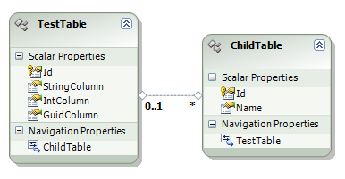
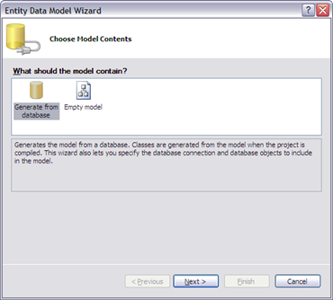
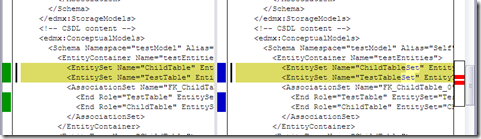

I ran into a curious bug in the Visual Studio Entity Framework Designer (edmx editor). There is an inconsistency in how entity sets are named when importing in a database compared to when their created or edited in the designer.

I have the following model for some basic Entity Framework testing:

 

To generate the model, I use the standard wizard that you use when you initially add an item of type "ADO.NET Entity Data Model" to your project.

 

Using this wizard, my model is created perfectly as one would expect. However, it appears that the code that generates the model from the database, and the code that is generated by the model editor are **different**.

Now, I edit my model by renaming "TestTable" to "TestTables", save the model, then simply rename it back to its previous name ("TestTables" to "TestTable"). When I compare the code, the names assigned to my entity sets have now changed:

 

The names of the entity sets went from being named after the tables, to being the name of the table with the "Set" suffix.

Because of how I implement the standard repository pattern with Entity Framework, the naming must be consistent. This issue means that whenever I generate a new model, I have to edit it in some way, and then save it. However, **future updates to the model from the database do not cause the names to revert back**.

Be aware that if you're importing your database model, you may see some inconsistencies between the import and the future data generated by the entity editor.