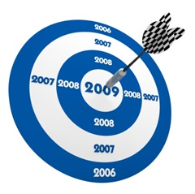

When it's time for your yearly performance reviews, how do you convey all of the great ideas you've had, the money you've saved the company, and the customers you've delighted? My suggestion is to start keeping track of your accomplishments. I think this is especially important in the software business where you may be seen as the guy that sits around at a computer all day.

 

I used to work for an incredibly huge (read: bureaucratic) company that required everyone to fill out a form every year, which was basically a resume. You were essentially going through the process of re-applying for your own job to determine your performance, and subsequently, your raise. Everyone hated doing it, but in hindsight I believe it was a good exercise. If I had been keeping a running list of my accomplishments, the process would have been much less painful.

In an ideal world, your boss would really understand your job and would know exactly how great you are. In fact, if you're a development manager reading this, I suggest you start keeping track of those types of things somewhere other than your head. It will help you evaluate your employees that don't listen to me!

If you're not keeping track of all of the amazing things you're doing throughout the year, there are a couple of obvious problems. First, there is usually a "dead" period right after a review in which your accomplishments are so distant from your next review that they slowly fade from everyone's mind. Second, you're just one of many employees that your boss has to manage. How likely is he or she to notice everything that you make look so easy? Not only that, but your career is more than just the accomplishments you had from the last year.

What should this list look like? Each line should be in the same format as an [accomplishment on your resume](http://www.google.com/search?q=resume+accomplishments). After all, you're trying to sell yourself just as you would when applying for a job.

>Feb 09
>
> * Implemented a new CMS system for the finance department saving $5300 annually.
> * Shortened the project planning process by removing duplicate steps, allowing projects to be delivered an average of 10% faster.  

Personally, I've already starting tracking my accomplishments. The next time I have a performance review coming up, I can send my boss the highlights for the past year, keeping them fresh in his mind. I hope I can motivate as least one other person to do the same. If I ever want to make a career move, I believe the list will also be very useful when updating my resume.

Do you already keep a list of your accomplishments? How have you found it useful?