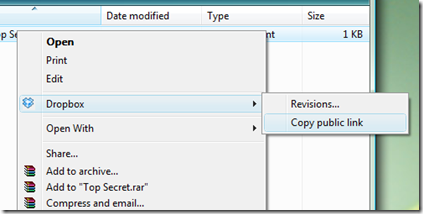
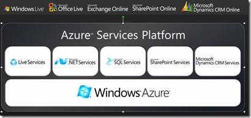
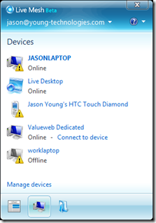
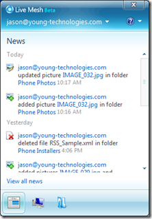

A couple of weeks ago, I finally signed up for [DropBox](https://www.getdropbox.com/). If you're unfamiliar with the service, it's a file synchronization service. You install a client on multiple machines, and you get a special folder (aka a dropbox). When you make changes on any computer, it's synchronized with a central server, as well as the other clients.

 

Now that I've gotten the chance to put DropBox through its paces, I have to say that I'm very impressed. I've done a lot of operations that can sometimes choke file monitoring software like moving and renaming files, copying files while synchronizing, and in-use files. DropBox powered through like a champ, never giving me any errors, and without any noticeable mistakes.

In addition to simply synchronizing your files, their service also keeps a copy of your files on their server. Better yet, it automatically revisions the files. It seems to be fairly efficient, even considering all my files and revisions. Right now I'm only using 7.8% of the 2GB of space they give you for free.

One of the applications that I use the most is OneNote. Pretty much all of my disconnected thoughts go into OneNote until I can get them organized. I figured it was a great application to test the responsiveness of DropBox. I opened OneNote on two different computers. When I changed the text on one machine, the changes showed up on the other in 10-15 seconds. Perfect for keeping my notes in sync!

My one and only complaint about DropBox is that I can't create multiple DropBoxes. A single DropBox is simple and efficient, but it would be nice to have a little more flexibility.

**Live Mesh**

A few nights ago, I got a demo of the Azure platform by a Microsoft Evangelist. Azure is a huge blank term for a group of confusing technologies. Even the name itself is confusing, since Azure is a cloud computing platform and is also the color of the sky when there are no clouds.

More importantly, one great thing to come out of the "Live Services" portion, is a free product called "Live Mesh". It's essentially a competitor to DropBox. The nice thing about Live Mesh is it's flexibility. I can make any number of synchronized folders, and they all seem to be as reliable as DropBox. Thanks to a sophisticated permissions system, you can even share folders with other people. For example, you can have a folder set up to distribute your photos to your family.

The Microsoft Azure Evangelist showed us a demo with the client installed on his laptop, and another client installed on his Windows Mobile phone. When he takes a picture on his phone, it's immediately pushed over to the other clients. It's a neat trick, and does make my mobile device more useful.

 

As far as I can tell, Live Mesh doesn't have plans to support a revision system like DropBox. I think this is a horrible, horrible mistake. Having a file on multiple machines provides nice redundancy, yet if you accidentally delete a file on one computer, Live Mesh will happily delete every copy of it. [It even happened to Scott Hanselman](http://www.hanselman.com/blog/TechnicalPresentationsBePreparedForAbsoluteChaos.aspx). In my opinion, this completely destroys any hope it has of competing with DropBox (at least for me). I'm hoping that they'll add a backup feature, or someone will use their API to add it for them.

**Others**

One service I have yet to try is [SugarSync](http://www.sugarsync.com/). It looks promising because it syncs multiple folders, stores revisions, and even has a Windows Mobile version (although it's missing real-time sync). On paper, it looks like it has all the options you would expect from this type of service.

[Syncplicity](http://syncplicity.com) looks respectable, but with so many alternatives, I'm just not sure if they have anything unique that sets them apart.

**Conclusion**

I think this type of application is going to have a huge market. This is one of those few killer app's that if done well, will be on everyone's computer. Obviously Microsoft's offering will be positioned to dominate, but we all know that they don't always have the absolute best product.

For now, I'll be using DropBox for my main document folder. It suits my needs, and until it messes up, I won't need to look elsewhere.