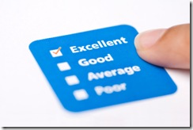

[Joel Spolsky](http://www.joelonsoftware.com/) and [Jeff Atwood](http://www.codinghorror.com/blog/) [stirred up some debate](http://blog.objectmentor.com/articles/2009/01/31/quality-doesnt-matter-that-much-jeff-and-joel) when they said "_Quality just doesn't matter that much_". At first, I was a little outraged. My entire development process is built around quality. Without it, airplanes would fall from the sky and your car wouldn't start in the morning.

 

So can we definitively put the quality question to rest? Unfortunately, "No".

First of all, we need to understand that quality isn't a Boolean. It's not "yes", you have quality, or "no", you don't have quality. Quality is a gradient, but it's even worse than that. Everyone sees it differently, and everyone experiences a different aspect of it. In short, quality is a multidimensional gradient!

I used to work at a small development company where I worked very closely with the President of that company. He was concerned with quality, but that took a backseat to the features that went into the product. The features themselves sold the product, and wowed the people writing the checks. Once they purchased our software, the integration efforts were large enough that the customer was essentially locked-in. Throw an expensive support contract into the mix, and it was a money making machine.

The company ended up being very successful, and was eventually assimilated by a huge company. The owners ended up walking away with a few million each. Try to explain to them that quality is more important than features!

Now fast-forward a few years, and we can examine what eventually happened. The product did work, and honestly it was the best in its class simply due to the scope of the problems it was trying to solve, and the high barrier of entry for competitors. However, the quality issues eventually caught up with the product. It became difficult to maintain and add extra features. The only solution was to slowly rewrite sections of it.

I think a great analogy is the turtle and the hare. If you're in for the long haul, you want to be the steady turtle. If you're in it for the short term, you want to be as quick as possible, even at the cost of stopping to nap. The problem is, you're making others suffer for your negligence.

If you want the best of both worlds, **build quality into your development process**. I'll be covering this in a series of articles that discuss unit testing (and testing in general) in exhaustive detail. They should be coming out by the middle of March. Stay tuned!