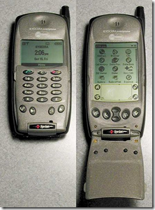
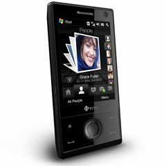

I know I'm nearly two years late to the game, but I finally went out an purchased an iPod Touch, and I have a feeling an iPhone will be mine in the near future. I've been blown away by how far ahead of it's time this thing is. More importantly, it amazing how much of an application ecosystem has developed in such a short time.

 

Back in the day, I bought one of the first Smartphone's to be sold in the United States, the [Kyocera 6035](http://en.wikipedia.org/wiki/Kyocera_6035). It was basically a Palm device glued to a phone. It was pretty cool since I could use the same device to play Monopoly and make phone calls. After getting rid of this phone, it would be years before I would get another so called "Smartphone".

Years later, I started getting into the Windows Mobile world (Pocket PC at the time). The Windows mobile platform is compelling because as a developer I can write applications using the .NET Compact Framework without a huge learning curve. It's also one of the few platforms that works/worked great with Microsoft Exchange. My current carrier of choice, Sprint, also tends to have a great suite of Windows Mobile phones. I also like the fact that any hackable feature is just a registry edit away.

 

My current phone is an [HTC Touch Diamond](http://en.wikipedia.org/wiki/HTC_Touch_Diamond). **On paper**, this is currently one of the most amazing phones ever created. It's one of the smallest Smartphone's you can buy, yet it has a fast processor, VGA screen, excellent GPS, light sensor, stylus sensor, accelerometers, resistive & capacitive features, etc. However, in reality, this phone drives me crazy. Opera is a decent browser except that it takes too long to open, and doesn't render as fast as it should on 3g. The push email features are pretty good except that the UI is a joke. Scrolling is not as smooth as it should be. Integration between apps is non-existent. The resistive screen isn't optimal for finger use. The experience is just laughable. The list goes on. I assumed these were all unavoidable simply due to the fact that it's a mobile platform.

Recently, I decided to try the iPod touch. It's my understanding that it's somewhat of a gateway drug to the iPhone. Essentially, it's the same thing but without a phone, a real GPS, and a microphone.

After using this device for a while, I am consistently surprised how streamlined and painless it is to use. Nearly every function works without even thinking about it. Every motion is perfectly smooth. No configuration is too difficult.

At first I was skeptical about the main interface, which consists of one or more screens full of icons. There is really no organization, no folders. The beauty of this design is in its simplicity. You're never more than one press away from the information you're looking for. Weather, click. Headlines, click. Calendar, click. Email, click. Touch Flo 3d on my HTC phone is essentially lipstick on a pig. It looks cool, and kind of works well if you're completely sober.

Now, let's get to the real reason that the iPhone is an unstoppable force. They have an insane application ecosystem. Most of the applications are not worth the bytes they're made of. However, a few of them are so simple, so elegant, and so efficient that they change the platform. For example, if I want to see what movies are in the theater, I can use the movie app. If I want TV listings, I use the TV app. If I want to find local events or lookup a number, I use the yellow pages app.

iPhone applications usually have similar functionality to what you get in your browser on your desktop or laptop computer, but they're typically designed to do one thing, and do it well. If you were to download an application to your computer specifically for getting movie times, I'm sure the experience would be similar, but on the desktop platform it's not quite worth it. I find myself using my iPod touch instead of my laptop to get a lot of quick information. I've also been opened up to a world of information that I normally would not have seen. For example, I have an application that shows me the local events in the area. I could have Googled for the same information, but this puts it all just a press away.

If you are someone that hasn't given the iPhone platform a try, do yourself a favor and go spend $230 on the iPod Touch. Then, visit the app store and download some freebies. If you're waiting for Windows Mobile or Android to catch up and build up the same application ecosystem, don't hold your breath.

I've been so excited by this platform that I ordered myself a Mac Mini that should hopefully be showing up tomorrow :-). Stay tuned as I talk about the experience of a c# developer writing an iPhone app in Objective-C!