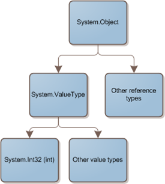

I've began working with a study group which was formed to study for the .NET Framework Application Development certification exam (70-536). I'm eager to get certified because I think it helps fill-in knowledge gaps that I may not have necessarily took the time to focus on normally. One of the first things that came up in our study group is the fact that **int**, which is an alias for **System.Int32**, derives from Sytem.ValueType, which, in turn, derives from **System.Object**. Let's take a close look at what that actually means, and how it's implemented.

When I first heard that **int** ultimately derived from Object, I didn't believe it for a number of reasons:

*   If you inherit from **Object**, that derived object IS an object*   If **int** is a subclass of **Object**, then boxing isn't necessary  

The truth is, my assumptions were not correct. The .NET team, for consistency sake, made all types fit nicely into the type hierarchy:

 

If the .NET team had built **System.Int32** to work like any other reference type, there would be clear performance issues. In reality, we need value types to be lean and mean. They are stored on the stack (instead of the heap for reference types). To do this, there is some internal "magic" going on that treats objects that inherit from ValueType differently. Behind the scenes it optimizes how they're used to get the best of both worlds. If you try to inherit from ValueType, you'll get a compiler error, because it is only exists for build-in value types.

Of course we want our cake and we want to eat it too. There are often times when you want to use a value type in a method that takes an object as a parameter. To keep up the illusion that a value type is an object, the framework employs boxing. It effectively wraps the value type inside of an object.

Take a look a the following code:
  
<pre name="code" class="c#">public string GetObjectString(object obj)
{
    return obj.ToString();
}

[TestMethod]
public void IntAsObject_Boxing()
{
    var str = GetObjectString(4);
    Assert.AreEqual("4", str);
}</pre>

And look at the corresponding IL for the test method:

<pre name="code" class="c#">IL_0001:  ldarg.0
IL_0002:  ldc.i4.4
IL_0003:  box        [mscorlib]System.Int32
IL_0008:  call       instance string _4_17_09_Boxing.UnitTest1::GetObjectString(object)
IL_000d:  stloc.0
IL_000e:  ldstr      "4"
IL_0013:  ldloc.0
IL_0014:  call       void [Microsoft.VisualStudio.QualityTools.UnitTestFramework]Microsoft.VisualStudio.TestTools.UnitTesting.Assert::AreEqual&lt;string&gt;(!!0, !!0)
IL_0019:  nop
IL_001a:  ret</pre>

Notice that boxing occurs on line 3\. It's using the IL "box" command to let you stay oblivious to the fact that there is some magic going on behind the scenes.

**Conclusion**

The end result is that we have an integer, which is an object, but isn't really, that needs to be wrapped inside of an object, which shouldn't be necessary, but is because it is. :-)

Does this really matter? Well, not really. For the most part you don't need to know this. If you're truly inquisitive and want to know what's going on, you may find it interesting.