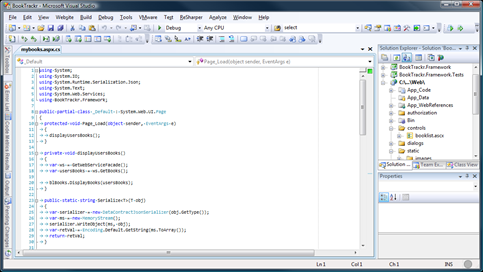
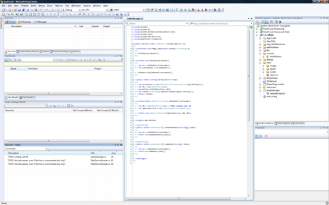

Today's tip comes from the "Anally Retentive" department. In the [.NET CLR team likes to keep their lines of code under 110 characters long](http://blogs.msdn.com/shawnfa/archive/2006/07/07/659281.aspx). I'm assuming that they're trying to maintain consistency and readability. I often try to maintain an imaginary line length limit, but I doubt I'm very consistent.

 

Fortunately, Visual Studio provides a hidden feature that lets you draw a vertical line in the text editor to show you where a certain line length would end. Fire up your registry editor and find this key:

###HKEY_CURRENT_USER\Software\Microsoft\VisualStudio9.0\Text Editor

If you're using a version of Visual Studio before 2008, you'll need to decrement the 9.0 version number in the path above.

Then, add the following value (as a string or REG_SZ) with the name of "**Guides**":

###RGB(192,192,192) 110

The first part is the color, and the second part is the line length. Personally, I use a line length of 110 to stay consistent with how Microsoft has chosen to do it. I like the color listed above because it's faint, but visible. Since the line is almost impossible to see in the screenshot above, here is an un-scaled screenshot of the line itself:

 

To further enforce the 110 character limit, you could also resize the code portion of your Visual Studio window so that it's near the line. This will make the line itself a little less annoying, while allowing you to use the rest of the window for other information. For example, take a look at how much room I have on a 1920x1200 screen when I horizontally resize my code window:

Obviously this tip isn't for everyone. You may be working with legacy code with long lines, or you might work on a team that doesn't mind long lines. The great news is that Visual Studio is pretty accommodating to however you like to work.