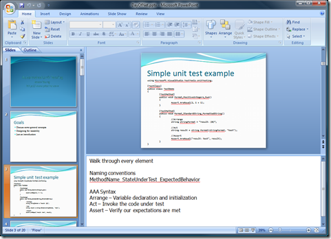

Justin Etheredge over at CodeThinked is [asking for tips for technical presentations](http://www.codethinked.com/post/2009/05/18/A-Technical-Presenters-Journey-Part-1-Know-Your-Audience.aspx). I can certainly relate to his experiences. Technical presentations, or any type of presentation for that matter, can be intimidating, difficult, and scary.

&#160; 

In my college days, I had to give a presentation in one of my information systems classes. I was pretty arrogant back then (ok, I still am), so I thought it would be a piece of cake to just wing it. I could save time and look like a cool speaker all at the time time. The result was me getting in front of the class, having my face turn red, and basically say "uh" and "um" for 10 minutes. It was so bad that people actually began to laugh. It pains me to even write about it.

A semester later, I had to give another presentation to an even bigger class. I was so nervous I can't even describe it. I spent hours upon hours making creating a "script" that I could simply read. The result was that I actually didn't even use the script. I actually knew what the hell I was talking about and ended up using the script as a reference. I did a great job speaking!

So how do I prepare for presentations these days? I have detailed notes, formatted specifically for the presentation. On my slides, I always keep the number of bullet points per slide low, usually 4 or less. In my notes, I organize them by bullet point so that I can walk though them while I go over each bullet point. **I try to balance simplify with detail. **The notes have to be **simple** enough to read quickly, but **detailed** enough that I can just read them out loud if I lose focus and forget the purpose. Bolding keywords and phrases can help quickly identify the key concepts while still having a readable version if needed.

 

I've seen many presentations where the speaker gets nervous and forgets what a slide or bullet point means. The usual remedy they employ is just reading the slide verbatim. Don't let this happen to you. **It is almost certain that you'll forget a critical piece of information during your presentation. The trick is to be ready for it.**

In my most recent [presentation (on Unit Testing)](http://www.ytechie.com/2009/04/speaking-at-day-of-net-at-fox-valley-tech.html), I actually wrote a paper on the topic I was presenting on. This allowed me to get all of my thoughts in order, and get feedback from others. Once I actually had to put together the PowerPoint, that was the easy part. I was basically creating an outline from an existing document, and the details became my notes.