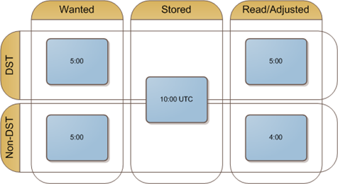

In .NET, the [DateTime](http://msdn.microsoft.com/en-us/library/system.datetime.aspx) structure provides us wonderful functionality, but this seemingly simple structure can cause a lot of headaches if you don't fully understand how to use it properly.

 

###Understand the terminology

First, UTC, GMT, and even Zulu time are all the same thing. They're basically a universal time clock that is not subject to changes in time zones or time changes. Each tick of the universal clock represents a moment in our perception of time. 

###Use UTC as long as possible

**UTC** is very useful when developing software because it removes the need to know where the time was from, or where it's going to be used. We don't even care _when_ it was from, or _when_ we're displaying it. You can think of your **local** clock as a view of the time right now, where you are. It has already taken into account the time zone and daylight savings time.

These properties of your local clock suggest that we should always convert from the local clock to universal time as early as possible when accepting user input, and convert it back to the users time only when displaying it. This is a simple, easy to use pattern that may be enough to avoid some of the potential problems that other projects face. This pattern will give you the ability to cope with time changes and time zones much more easily.

Converting between local time and UTC is pretty easy. [ToLocalTime](http://msdn.microsoft.com/en-us/library/system.datetime.tolocaltime.aspx) will convert from universal time to local time. [ToUniversalTime](http://msdn.microsoft.com/en-us/library/system.datetime.touniversaltime.aspx) will convert to UTC. Just be aware that these methods have a certain amount of logic in them that only has the rules that were in effect when they were written. They are not perfect for all scenarios. You'll also want to take a look at the [Kind](http://msdn.microsoft.com/en-us/library/system.datetime.touniversaltime.aspx) property, which affects which conversions you can perform, as well as providing a nice way to keep track of whether or not he time has been adjusted to UTC.

###Daylight Savings Time & Time Changes

Every year in many parts of the world, the time changes. Apparently the idea is to save gobs of money by using the sunlight more efficiently instead of using artificial lights. Unfortunately, this really sucks for software developers.

I used to write software for manufacturing facilities that would run during a time change. If you have software that records and time-sensitive data during a time change, your software had better be prepared to handle it the fact that one hour is skipped, and another is repeated. Storing the data in UTC solves part of the problem. Unfortunately, when you try to display the data you'll have an hour of missing data, and a hour with overlapping data. **You may have to design your user interface to deal with this**.

###Fixed-time Appointments

Unfortunately, UTC doesn't solve all of our time offset problems. Let's say that you have an appointment that you're scheduling for a future date that occurs when DST is in effect, but it's not in effect right now. You choose 5:00am for your appointment time. Your application happily converts the time to UTC, and the reverse process expectedly yields the same result. The problem is, the time offset when the appointment occurs will be different than it is now. Daylight savings for the central time zone for example, switches between and offset of -5 and -6\. This diagram attempts to visualize:

 

What we want to store is the fact that our appointment occurs at **5:00am local time**. If we simply store the information as UTC, we're losing this additional information. When we switch to **non-DST** time and use our current time adjustment of **-6 hours**, our appointment now occurs at **4:00am**.

If you're writing an application that stores fixed-time appointments as well as appointments that are designed to have even intervals (exactly 1 month apart, etc) or occur in a different time zone or DST, you'll need to store an additional flag with the event so you can make the determination if it needs to be adjusted.

###Conclusion

Times can be complicated depending on the requirements of your project. It would be unwise to work these problems out toward the end of a project, because the consistency of usage can't be guaranteed. Do yourself a favor and plan ahead for these issues, and it will be much easier.