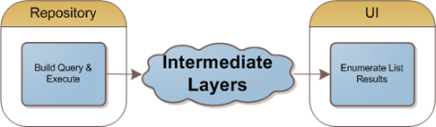
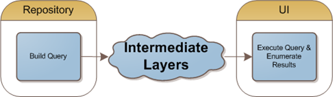

LINQ to SQL and Entity framework allow us to build a query, which gets translated into an expression tree, and executed once the full query is built. The beauty is that we can build up a query using multiple expressions and Lambdas, without actually querying the data. Since these types of queries are delay loaded, why not avoid executing them until the last possible moment? Read on to see why this is usually a bad idea.

First, let's take a look the code for a repository method that builds a query, executes the query, and returns the results in a list:

	public IEnumerable<Cat> FindAllCats()
	{
		var query = from c in db.Cats
			select c;
	
		return query.ToList();
	}

 

The "ToList" is forcing the IQueryable<Cat> query to execute and put the results in a list **immediately**. However, we know that IQueryable<T> inherits from IEnumerable<T>, so what happens if we avoid the list creation completely?

	public IEnumerable<Cat> FindAllCats()
	{
		var query = from c in db.Cats
			select c;
	
		return query;
	}

In this scenario, our method is returning the same interface, but the underlying type is now a LINQ database iterator instead of a List<T>.

###Delaying execution can lead to _multiple_ executions

If the code is not explicitly putting the results into a list, we're actually passing back a form of an iterator. This works great if we only need to execute the query once. However, if we iterate through the list more than once, **we actually end up executing our query multiple times**. This can obviously lead to poor performance.

If you're writing fast queries, you may not even notice if they're being called too many times. However, there may be a worse problem lurking in your code. **Each time you iterate through the enumerator, you're getting a different set of objects**. The same query is being made with the same results, but the objects are re-built each time. This leads to objects that are **equivalent, but not the same**. For example, you may get back Cat objects with the names "Bill" and "Ted", but if you actually check them for equality using "==", they will not be the same object **instance**. **(Correction: Scott points out in the comments that this isn't necessarily the case. Keep in mind that it can still occur if projecting types and not working with the original objects.)**

###Delaying execution may mean you no longer have a database connection when attempting to execute the query

If you delegate the task of initiating your query to another layer, you better be sure that the database connection is still around, and is in a queryable state. If you're using the standard repository pattern and a short-lived database connection pattern, you may quickly run into problems when you try to iterate through the results of the enumerator you receive from your repository layer.

###Conclusion

If you're thinking about moving the execution of your queries to another layer, make sure you understand the consequences. You'll need to weigh those consequences against the tiny benefit that you'll receive from the delayed execution. There may be cases where delaying the execution or possibly avoiding it completely will improve your application, but those are probably very rare cases.