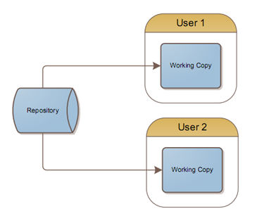
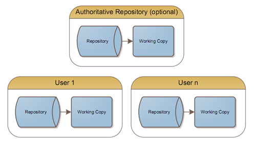
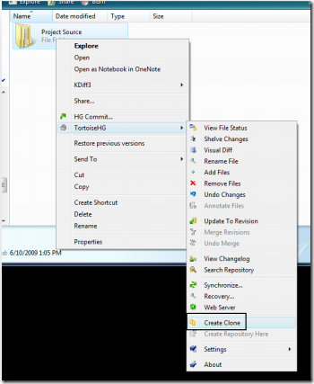
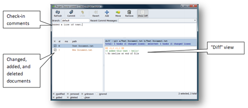
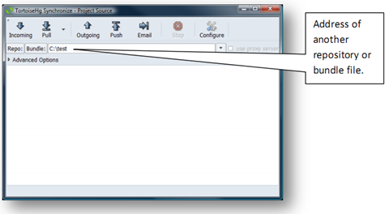
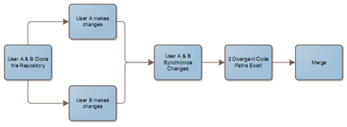
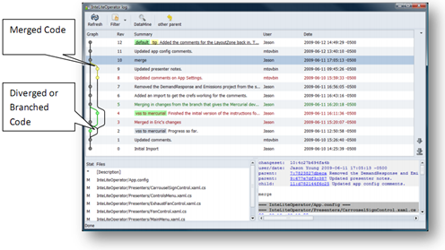
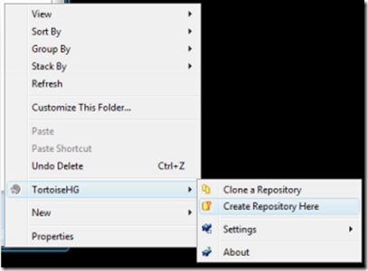
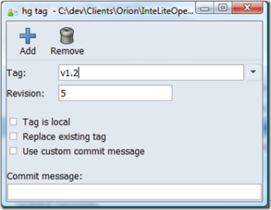

Version control systems manage the changes of documents. In software development, their primary purpose is to store the source code for an application, as well as every revision created during its development.

Currently, many developers use a centralized version control system such as Visual Studio Team System (VSTS) or Subversion. With such systems there is a central repository (i.e., Team Foundation Server (TFS)), usually located remotely, that houses the different versions of source code.

 

Unfortunately, a number of issues accompany typical source control systems that are based on a centralized repository, including, but not limited to the following:

*   Many operations such as checking code in or out can perform poorly over slow connections.*   Working offline results in a reduced set of functionality, such as branching or committing multiple features or bug fixes.*   Moving the repository can be difficult due to the fact that there is front-end **and** back-end management.*   Working between networks that may never become bridged is impossible or difficult, since a connection must be made to the central repository.*   Private work is typically not under source control.*   There is often a single point of failure.*   Security must be managed, and may become complex due to multiple permission sets and projects.  

Distributed source control systems (or distributed version control systems, &quot;DVCS&quot; for short) are starting to gain popularity because they offer many advantages over the traditional, centralized repository.

 

They allow users to work independently in either a connected or disconnected environment. There is a tremendous amount of flexibility in regards to merging, managing different branches of development, and managing product features. 

Adopters of this technology include Google Code and Sourceforge. Moreover, many major projects such as GNOME, Perl, MySQL, Python, and Ubuntu are also using a distributed source control system.

You may have already heard about some of the popular implementations. Git, Mercurial, and Bazaar are a few choices that have started to become mainstream. If you've worked with Subversion, you'll find that migrating to this new generation of source control systems doesn't mean giving up the features that you're used to.

There are many problems with centralized repositories that simply disappear when you're working with a distributed system:

*   Merging is a core feature and works _how_ and _when_ you want.*   Security is trivial since everyone works in their own sandbox. You simply choose who you allow pushing and pulling changes to and from. In open source projects, this typically means allowing certain trusted individuals to push changes to the project repositories. When needed, additional security models such as authentication can be imposed.*   Working disconnected doesn't require any preparation. You are working offline by default. The only online operation is synchronizing with other repositories.*   All operations are near-instantaneous. Synchronizing is the only operation that is dependent on the speed of your connection.  

&#160;
 **What is a Distributed Source Control System?**   

Distributed source control systems have the same purpose, but work much differently than systems like Team Foundation Server (TFS), SourceSafe, Subversion, and CVS. Instead of having a single repository that contains the source code and history, there are many repositories that have the source code, and some or all of its revision history. One or more peers have repositories for a project, and synchronize what they want, when they want to. There are really no requirements or restrictions. The focus is on synchronizing and working independently.

**Workflow**

Examples &amp; screenshots included here are from Mercurial using the TortoiseHg explorer extension. Git has similar functionality using TortoiseGit. You can also use the command line for all/some operations if you prefer.

1\. **Clone a repository** - To create your own local repository, you have to clone (copy) all or part of an existing repository. Since each developer has a copy of the repository, you can clone it from anyone.

 

2\. **Create a &quot;working copy&quot; of the code** - Even though you have the full repository from another developer, you still need to &quot;check-out&quot; or get the latest version of the code. Since the repository is local, this operation is quick and can be done **offline**.

3\. **Make changes** - Simply make any changes you like, without concerning yourself about how your source control works. This is similar to Subversion, and contrasts sharply with TFS which needs to track any changes you make by interfacing with Visual Studio.

4\. **Check-in changes** - When it's time to check in your local changes, they are simply committed to your local repository. They **do not affect any other repository**. Changes are detected by comparing the newest committed revision with the current version on disk.

 

5\. **Push or pull changesets** - To actually send your changesets to another repository, you need to &quot;push&quot; or &quot;pull&quot; them. In the Mercurial dialog below, there are options labeled &quot;Incoming&quot; and &quot;Outgoing&quot; which simply compare the local changes with the remote changes and determine what will get pushed or pulled. The &quot;Push&quot; and &quot;Pull&quot; operations send your changesets to another repository, or pull changesets from another repository respectively.

 

When changesets are transferred between repositories, they **do not affect any working copies**. This flexibility allows changes to be synchronized without affecting work in progress.

**Online/Offline Operations** 

   <table style="border-collapse: collapse" border="2" cellspacing="0" cellpadding="0"><tbody>       <tr>         <td valign="top" width="143">           
**Operation**
         </td>          <td valign="top" width="167">           

**TFS**
         </td>          <td valign="top" width="166">           

**Subversion**
         </td>          <td valign="top" width="163">           

**Mercurial/GIT/Bazaar**
         </td>       </tr>        <tr>         <td valign="top" width="143">           

**Get/Update**
         </td>          <td style="background-color: red" valign="top" width="167">           

Online
         </td>          <td style="background-color: red" valign="top" width="166">           

Online
         </td>          <td style="background-color: green" valign="top" width="163">           

Offline
         </td>       </tr>        <tr>         <td style="background-color: red" valign="top" width="143">           

**Check-out**
         </td>          <td style="background-color: red" valign="top" width="167">           

Online
         </td>          <td style="background-color: red" valign="top" width="166">           

Online
         </td>          <td style="background-color: green" valign="top" width="163">           

Offline
         </td>       </tr>        <tr>         <td valign="top" width="143">           

**Check-in**
         </td>          <td style="background-color: red" valign="top" width="167">           

Online
         </td>          <td style="background-color: red" valign="top" width="166">           

Online
         </td>          <td style="background-color: green" valign="top" width="163">           

Offline
         </td>       </tr>        <tr>         <td valign="top" width="143">           

**View History**
         </td>          <td style="background-color: red" valign="top" width="167">           

Online
         </td>          <td style="background-color: red" valign="top" width="166">           

Online
         </td>          <td style="background-color: green" valign="top" width="163">           

Offline
         </td>       </tr>        <tr>         <td valign="top" width="143">           

**Revert**
         </td>          <td style="background-color: red" valign="top" width="167">           

N/A
         </td>          <td style="background-color: green" valign="top" width="166">           

Offline
         </td>          <td style="background-color: green" valign="top" width="163">           

Offline
         </td>       </tr>        <tr>         <td valign="top" width="143">           

**Compare working changes**
         </td>          <td style="background-color: red" valign="top" width="167">           

Online
         </td>          <td style="background-color: green" valign="top" width="166">           

Offline
         </td>          <td style="background-color: green" valign="top" width="163">           

Offline
         </td>       </tr>        <tr>         <td valign="top" width="143">           

**Change tracking**
         </td>          <td style="background-color: yellow" valign="top" width="167">           

Limited*
         </td>          <td style="background-color: green" valign="top" width="166">           

Offline
         </td>          <td style="background-color: green" valign="top" width="163">           

Offline
         </td>       </tr>     </tbody></table> 
  

* Changes can be made in a special &quot;offline&quot; mode, and edited files will be checked-out when returning to &quot;online&quot; mode.
 **Merging Divergent Development Branches**   

In traditional, centralized source control systems, the only way for a divergence in code paths was to explicitly create a branch. While this is still possible in a distributed source control system, it is also possible for multiple developers to make independent changes that may or may not conflict.

The beauty of the system is that divergent code paths can be merged at any time. It is possible for the developers to make multiple changes, perform multiple synchronizations (pulls), yet not have to merge until they want to, or until they need to push their changes to another repository.

 

 
 **Where Is My Repository?**   

If you're working with a team of 20 developers, and each one has a full copy of the repository, you don't **_need_** a central repository. However, there are a few reasons why it is recommended:

1.  **Central backup location** - Even though you have numerous copies of the repository, it is still useful to have a single location that can be used as a place where an automated backup process is able to find it.2.  **Central communication hub** - The logistics of pushing and pulling code between a number of developers can get complicated. Distributing your repository simplifies many of these problems, but is not perfect by itself. Having a central &quot;authoritative&quot; repository can make it quick and easy for developers to collaborate.3.  **Central location for builds** - Automated builds and continuous integration servers need a location to pull source code from, which an authoritative repository provides.4.  **Central merge location** - If multiple developers are pulling changes from one another, implicit branches can be created. A central repository serves as location where all of these branches are merged into one development line.  

Repositories can typically be easily hosted internally using Apache, a built in daemon, CGI script, or simply just a file share. For simplicity, there are many services that provide repository hosting. For Git, there is GitHub and SourceForge. For Mercurial, there is BitBucket, Google Code, and SourceForge.

The beauty of distributed source control is apparent when you take into account the administrative overhead of a central server. Since the central server is no different than any other peer, **it can be easily moved or modified**. For example, you can start out with no central server, then you can use BitBucket to store your revisions, then you can move to another service within minutes. Changing providers simply means pushing your changes to another server.
 **<u>Common Operations</u>**   

**Importing Existing Code**

Importing existing code is an extremely simple operation. If it is new code that is not yet under source control, you can simply create a new repository within the folder that contains your code. You can then check in your code as desired.

In Subversion, the import process involved importing the code into the repository, and then checking out a working copy. Mercurial does not have this complexity.

 

Mercurial also comes with built in support for converting existing Subversion repositories to Mercurial repositories, including the entire revision history. [More information is available here](http://www.selenic.com/mercurial/wiki/ConvertExtension).

To convert from an older source control system such as Visual Source Safe, you can first [convert the repository to Subversion](http://www.pumacode.org/projects/vss2svn), and then to Mercurial.
 **&#160;** **Checking-in Code**   

It is worth mentioning a typical philosophical difference between how some source control systems promote the check-in process for changes. Systems like TFS and Visual Source Safe only provide [**limited functionality for reverting**](http://msdn.microsoft.com/en-us/library/ms194956(VS.80).aspx) and re-applying specific changesets. For this reason, developers tend to check-in groups of unrelated changes. This tends to lead to less useful generic or incomplete comments such as &quot;done for the day&quot;.

Flexible source control systems such as Subversion, Mercurial, and Git provide a lot more value when changesets are fine-grained, and represent a single change to the system. For example, renaming a page and changing the tab order are two changes that should be checked-in separately. If needed, either feature can be pulled in or out, moved, synchronized, or used to patch other versions. It also reduces the likelihood of conflicts, and typically makes conflict resolution easier. Other developers can quickly scan through the changelog and get a clear list of the features that were added, or bugs that were fixed. In an ideal world, all commits should be tied to a bug or feature to increase traceability.
 **Managing Branches &amp; Releases**   

It is simple to create **explicit branches** that allow you to maintain parallel development of different features or versions. Branching simply involves entering a branch name when you commit your code. Switching between branches is as easy as performing an update to the latest revision of a branch. In contrast, TFS requires a branch to be created before you can commit changes to it. TFS also keeps a copy of each branch on the developers machine, which is optional with Subversion, Mercurial, and others.

Since changes can be made independently, there is also a concept of **implicit branching**. If we have two users, Ann and Bob, they are free to make changes independently of each other. If Ann checks in her changes, and then Bob pulls down those changes while having changes of his own, there are now two implicit branches of development. In this case **pulling** changes will automatically create multiple parallel lines of development. Changes cannot be **pushed** unless the code has been merged. The system is designed this way so that merging is only necessary when pushing, typically to a central repository or build server. The effect is that repositories that are only &quot;pushed to&quot; can be easily and cleanly maintained remotely.

Most distributed source control systems include tools that allow a visual display of code branches. This functionality is also likely to be included in Team Foundation Server 2010.
 **Tagging Revisions**   

In order to mark the significance of certain revisions, they can be tagged with a specific label. For example, when you release a specific version of your project, you can tag that revision with the label &quot;v1.2&quot; as seen below. Additional flexibility is provided by the &quot;local tag&quot; functionality, which lets you tag code on your computer without sharing the tag with others.

 
 **Terminology**   

**Distributed Version Control System (DVCS)** - Version control systems manage the changes of documents. In software development, their primary purpose is to store the source code for an application, as well as every revision created during its development.

**Repository** - A container for a set of changes that represent the history of the source code for a project. A repository may have the ability to store a partial history of the project, or the entire history. The repository is typically optimized by using compression and by only storing deltas or changes of files.

**Changeset/Revision** - A particular &quot;delta&quot; or change in the codebase. This can include any type of change, in any number of files. Visual Source Safe stored revision numbers for each file. Team Foundation Server and Subversion have global revision numbers for the entire repository. Distributed source control systems often use GUID's or hash codes to represent specific revisions.

**Working copy** - A particular revision of the code that has been extracted or checked out from the repository. This revision includes the full version of all the files involved so that the developer can load and make changes to the code.

**Bundle** - A bundle is a file that contains a set of changes that is intended to be sent to another user to update their repository. This technology allows users to be physically disconnected yet pass code changes to each other. This file typically employs some form of compression to minimize file size.

**Patch/diff** - A patch is a file that shows the changes between two versions of a file or multiple files. It contains enough information to transform the old version into the new version, or vice-versa. It's a quick way of sending someone a changeset. Patches are usually in the &quot;unified diff&quot; format, which looks like the following:
  <pre style="border-bottom: black 2px solid; border-left: black 2px solid; padding-bottom: 4px; background-color: lightgrey; margin: 5px; padding-left: 4px; padding-right: 4px; border-top: black 2px solid; border-right: black 2px solid; padding-top: 4px">--- /path/to/original timestamp 
+++ /path/to/new      timestamp 
@@ -1,3 +1,9 @@ 
+This is an important 
+notice! It should 
+therefore be located at 
+the beginning of this 
+document! 
+ 
 This part of the 
 document has stayed the 
 same from version to 
@@ -5,16 +11,10 @@ 
 be shown if it doesn't 
 change.  Otherwise, that 
 would not be helping to 
-compress the size of the 
-changes. 
- 
-This paragraph contains 
-text that is outdated. 
-It will be deleted in the -near future. 
+compress anything. 

 It is important to spell 
-check this dokument. On 
+check this document. On 
 the other hand, a 
 misspelled word isn't 
 the end of the world. 
@@ -22,3 +22,7 @@ 
 this paragraph needs to 
 be changed. Things can 
 be added after it. 
+ 
+This paragraph contains 
+important new additions 
+to this document. </pre>

#### &#160;

#### References

*   [http://msdn.microsoft.com/en-us/library/ms194956(VS.80).aspx](http://msdn.microsoft.com/en-us/library/ms194956(VS.80).aspx)*   [http://www.pumacode.org/projects/vss2svn](http://www.pumacode.org/projects/vss2svn)*   [http://www.selenic.com/mercurial/wiki/PublishingRepositories](http://www.selenic.com/mercurial/wiki/PublishingRepositories)*   [http://betterexplained.com/articles/intro-to-distributed-version-control-illustrated/](http://betterexplained.com/articles/intro-to-distributed-version-control-illustrated/)*   [http://code.google.com/p/tortoisegit/](http://code.google.com/p/tortoisegit/)*   [http://bitbucket.org/tortoisehg/stable/wiki/Home](http://bitbucket.org/tortoisehg/stable/wiki/Home)*   [http://msmvps.com/blogs/vstsblog/archive/2008/08/17/how-microsoft-uses-team-foundation-server-internally.aspx](http://msmvps.com/blogs/vstsblog/archive/2008/08/17/how-microsoft-uses-team-foundation-server-internally.aspx)*   [http://blogs.msdn.com/bharry/archive/2007/09/15/update-on-microsoft-tfs-adoption.aspx](http://blogs.msdn.com/bharry/archive/2007/09/15/update-on-microsoft-tfs-adoption.aspx)*   [http://blogs.msdn.com/bharry/archive/2008/09/15/september-08-devdiv-tfs-dogfood-statistics.aspx](http://blogs.msdn.com/bharry/archive/2008/09/15/september-08-devdiv-tfs-dogfood-statistics.aspx)
**Recommended Reading** 

*   [Illustrated introduction to distributed version control](http://betterexplained.com/articles/intro-to-distributed-version-control-illustrated/)*   [Mercurial QuickStart](http://www.selenic.com/mercurial/wiki/QuickStart)*   [Mercurial: The Definitive Guide](http://hgbook.red-bean.com/read/)*   [TortoiseHg Download](http://bitbucket.org/tortoisehg/stable/wiki/install)*   [Google's Analysis of Git vs Mercurial](http://code.google.com/p/support/wiki/DVCSAnalysis)