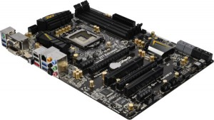
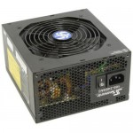
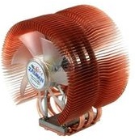
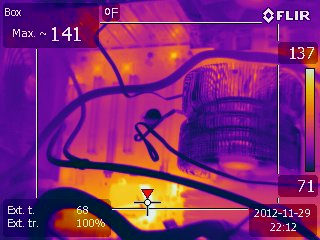

I recently had an opportunity to sell my original i7 920 PC, and build a 3rd generation Ivy Bridge.  My goal was to minimize power usage so that I could run it as a 24/7 media server, and maximize its encoding horsepower. After hooking this build up to a Kill-A-Watt, it measured at just over 30 watts at idle, and less than 100 watts maxed out.
<table border="1" cellspacing="0">
<tbody>
<tr>
<td>Component</td>
<td>Price</td>
<td>Name</td>
</tr>
<tr>
<td>PSU</td>
<td>$89.99</td>
<td>SeaSonic M12II 620 Bronze 620W ATX12V V2.3 / EPS 12V V2.91 SLI Ready 80 PLUS BRONZE Certified Modular Active PFC Power Supply</td>
</tr>
<tr>
<td>Motherboard</td>
<td>$104.99</td>
<td>ASRock Z77 Extreme4 LGA 1155 Intel Z77 HDMI SATA 6Gb/s USB 3.0 ATX Intel Motherboard</td>
</tr>
<tr>
<td>CPU Fan</td>
<td>$49.99</td>
<td>ZALMAN CNPS9500A-LED 92mm 2 Ball CPU Cooler</td>
</tr>
<tr>
<td>Memory (32GB)</td>
<td>$109.98</td>
<td>G.SKILL Ares Series 16GB (2 x 8GB) 240-Pin DDR3 SDRAM DDR3 1866 (PC3 14900) Desktop Memory Model F3-1866C10D-16GAB</td>
</tr>
<tr>
<td>Intel 3.5Ghz i7 Ivy Bridge</td>
<td>$299.99</td>
<td>Intel Core i7-3770K Ivy Bridge 3.5GHz (3.9GHz Turbo) LGA 1155 77W Quad-Core Desktop Processor Intel HD Graphics 4000 BX80637I73770K</td>
</tr>
<tr>
<td>Antec 300 Case</td>
<td>$44.99</td>
<td>Antec Three Hundred Black Steel ATX Mid Tower Computer Case</td>
</tr>
<tr>
<td>128GB SSD HD</td>
<td>$102.44</td>
<td>Crucial 128 GB m4 2.5-Inch Solid State Drive SATA 6Gb/s CT128M4SSD2</td>
</tr>
<tr>
<td>LG Blu-ray Drive</td>
<td>$94.99</td>
<td>LG BH14NS40 14X SATA Blu-ray BDXL Internal Rewriter with Software - Retail Box</td>
</tr>
</tbody>
</table>
###Total Price: $897.36 + shipping

###Processor: Intel Core i7-3770K 3.5GHz

This was the first component I picked out, as a suspected all of the other components would be dependent on the processor. We have built some AMD machines at work, but they are severely lagging behind their Intel-based counterparts for performance and power usage. Intel is a little pricier, but definitely worth it. I went on the high-end as far as speed to minimize video encoding time, and hopefully prolong my next upgrade as long as possible.

Since I don't have any intentions of using this system for high-end gaming, my goal is to actually use the Intel 4000 graphics that are integrated into the chip. Integrated graphics are still significantly behind their discrete counterparts, but this saves me over 100 watts of power usage.

###Motherboard: ASRock Z77 Extreme 4

I always find the motherboard the hardest component to spec for a new build. In the past I've chosen Gigabyte boards for their low price and innovative features such as long-life [solid state capacitors](http://www.badcaps.net/pages.php?vid=4). However, I ran into some buggy firmware with my last build, and hoped to avoid them this round. Solid state capacitors are now the norm, so features and stability were my primary goals. We've used a few ASRock boards for builds at work, and they have worked flawlessly. They are also the current leader for [fast booting](http://www.youtube.com/watch?v=JdOAvlncCOw&amp;feature=youtu.be) when using UEFI. At $105 for this board, it seemed like a great price/value ratio. It has dual-monitor outputs so that I can use the integrated graphics while still keeping 2 monitors.

Below is a thermal image from the board. Notice that the ASRock chipset is at 143F. I can't explain why it runs so hot. It's not hot enough to be a huge concern, but I would prefer to keep every component cool for long life.

###Memory: 32GB G.SKILL

Memory speed used to have a significant impact on the real-world performance of your system. These days, buy memory that is well reviewed and falls within the memory speed requirements of your motherboard. At the time of my purchase, I was able to get the Ares memory for only $55 for 2x8GB strips. At this price, it was worth maxing out the board at **32GB** (I'm still in awe) just to avoid a future upgrade. One interesting feature of the motherboard is the ability to use part of the RAM as a RAMDISK, which is essentially a virtual hard drive that would outperform even the best SSD.

###PSU: SeaSonic M12II 620 Bronze 620W

Bad power supplies create bad power, which kills components. A good power supply will provide clean power, which will make your system more stable, and will help ensure a long lifespan for all of the other components.

Why did I choose a 620W power supply? My experience has been that people often oversize their power supplies. If you use a 1000W power supply on a 50W load, it's going to be terribly inefficient. Power supply efficiencies, which measure the amount of power lost in the conversion from AC to DC, are only accurate when the power supply is under heavy load. As you get out of the sweet spot, efficiency drops. When sizing a power supply, the #1 power consumer is your video card. An inefficient video card will pull more power than the rest of your system. Add multiple cards and the power requirements go through the roof. In my case, I'm using integrated graphics and shooting for low power usage. My goal was to stay under 100W at load on the DC side of the power supply. With an 85% efficiency, that would be about 118 watts on the AC side. Even at 620W, this power supply is WAY oversized. However, I have a quality power supply that gives me plenty of headroom for any upgrades down the road. Besides, there are not many well-built power supplies at lower wattages these days.

###Hard Drive: Crucial m4 128GB SSD

SSD's are undoubtedly the biggest technological breakthrough in computing as it relates to the perceived speed of the computer. People usually quote 7 second boot times, but the value is truly in the fact that applications open **instantly**.

I've had my fair share of bad luck with SSD's. Since they're a newer technology than their spinning disk counterparts, they have firmware that can be buggy in certain versions. I was a victim of the [OCZ firmware bug](http://www.anandtech.com/show/4973/sandforce-identifies-firmware-bug-causing-bsod-issue-fix-available-today), as well as the [7 month bug in the Crucial drives](http://news.softpedia.com/news/Crucial-Delivers-New-Firmware-for-SSDs-Which-Used-to-Fail-After-7-Months-246766.shtml). That being said, I trust this drive thanks to its fairly consistent track record, and favorable performance.

Why only 128GB? I have a 3TB storage array that I use for my bulk data. Unless you install a number of large games on your SSD, or store other bulk data, 128GB is fine for just about everyone. If you feel more comfortable with the 256GB version, the price gap has closed significantly.

###Case: Antec 300

I hate choosing a case. Without seeing them in person, it's difficult to gauge their build quality and features. I've used this case in the past, and it's worked well enough. It's usually inexpensive, and easy to work with. It has excellent ventilation, a cleanable air filter, and a place to mount your SSD drive.

###CPU Fan: ZALMAN 92mm

I ran some temperature tests on the i7 Ivy Bridge with a stock cooler, and found that it can run pretty hot under load. An upgraded fan was probably not absolutely necessary, but it's a $50 investment that guarantees that your CPU will run 20-30c cooler. This one is a simple design that's easy to install, and the copper fins dissipate heat very easily.

Here is a photo using a Flir thermal camera. Notice that there is almost no measurable heat coming from the heat sink on the right side of the image.

###Blu-ray / DVD: LG Blu-ray Drive

This was probably overkill, but it was the only Blu-Ray drive that I could find that got exceptional reviews, and is 16x.