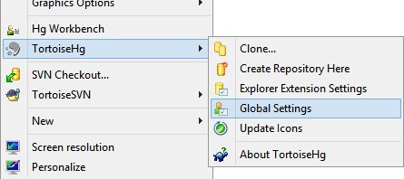
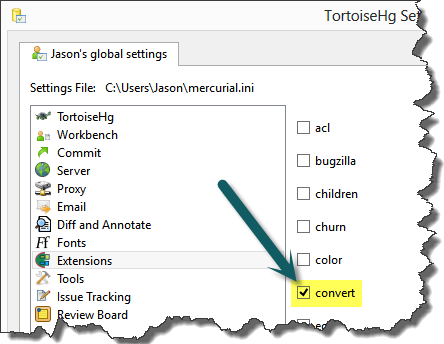
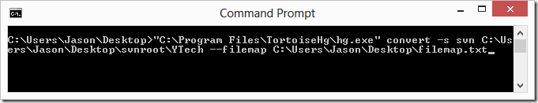

A few years ago, I set up a privately hosted Subversion repository to hold the source code for all of my various non-work related projects. These days, it is showing it's age, as the world and my professional life has moved on to [Distributed Source Control (DVCS)](http://www.ytechie.com/2009/11/introduction-to-distributed-source-control.html). I decided it was time to convert to something more modern, maintainable, and upgradable in the future.

In this post, I'll show you how I converted my repositories over to Mercurial to archive them in Kiln, complete with history. There are a number of ways to accomplish this goal, and I thought this method was fairly simple and straightforward.

**Instructions**

First, install [TortoiseHg](http://tortoisehg.bitbucket.org/) if you haven't already done so. You actually won't need Subversion installed to do the conversion.

Next, right click anywhere in an Explorer window, select TortoiseHg-&gt;Global Settings:

Go to the &quot;Extensions" section, and check the "convert" checkbox, which will enable the conversion extension functionality:

**One Repository vs Many**

In Subversion, there were two common repository structure camps. One that used a single repository for multiple projects, and those that used a separate repository for each project. Due to the complexity of setting up projects on the Subversion server, I always stuck with the "one giant repo" model.

In Git, repositories will be distributed and are ideally as lightweight as possible. The typical pattern is to create a new repository for each project. This obviously means that we have to do some work to separate out a single Subversion repository into multiple Git repos.

**Creating a Filemap (optional)**

_<u>If you have separate repositories in Subversion, you can skip this step.</u>_

Create a "filemap", which is just a text file with the name of your choosing that will look like this:
  <pre>include &quot;Utilities/ProjRefToDll&quot;
rename &quot;Utilities/ProjRefToDll&quot; .</pre>

The first line is telling the converter to _only_ include the path specified. The second line is telling the converter to move the project to be in the root (note the period) of the new repository. If we leave this out, we'll only have the project we're looking for, but our source code will be nested under folders from our old structure.

You'll need to update this file for each project you convert.

**Convert!**

Run the following command line with the correct paths (omit the filemap parameter if converting the whole repo):

<pre>&quot;&lt;path-to-hg&gt;\hg.exe&quot; convert -s svn &quot;&lt;path-to-svn-repo&gt;&quot; --filemap &quot;&lt;path-to-optional-filemap&gt;&quot;</pre>

Here is the command I ran:

It will then iterate through every revision in the source repository, even if it's not relevant to the filter you're applying. It will create a new folder next to the folder you're converting, but with a "-hg" suffix, like this:

Open it up, and it will be a full-fledged Mercurial repository. Do an "update" to confirm that everything looks like you expect:

_At this point, you have successfully converted a project from your Subversion repository into a Mercurial repository, revisions and all._

Personally, I'm using [Kiln](http://www.fogcreek.com/kiln/) as my online source archive. Even if you aren't interested in Kiln, and instead want to use something like [GitHub](https://github.com/), no problem, push it up to Kiln, and then pull it via Git for an [automatic conversion](http://blog.fogcreek.com/announcing-kiln-harmony-the-future-of-dvcs/) at any time! I'm using Kiln for the time being, considering that it's [free for up to 2 users](http://www.fogcreek.com/kiln/StudentAndStartup.html). It works great for my personal projects that I don't want public on GitHub. My plan is to eventually scrub those projects, and put the latest revision of each out on GitHub to make available to the community.

I'm not sure if I'm switching the full repositories to Git yet, so I like the flexibility that Kiln offers. If you are interested in converting to Git directly, [there is probably an easier way](https://www.google.com/search?q=convert+subversion+to+git).