With the recent GA release and rapidly growing usage of virtual machines within Windows Azure, many are trying to set up an independent/non-VPN network. The great part of Azure virtual machines is that it can be as flexible as a set of PCs or VMs hosted within your own datacenter. Many of these scenarios require a more flexible local DNS server than what is provided by default in Azure. For example, programmatically building a dynamic cluster of VM's. In this post, I'll show you how to get up an running with a DNS server quickly and easily.

After you've created your Azure network (outside the scope of this post), you can feel free to divide your network into logical subnets. The DNS server will work fine across any subnets within your network.

###Installing the DNS Server Role

Typically, a DNS server should be configured with a static IP address. In the case of Azure, the servers must use DHCP, but **the lease they receive lasts for the life of the machine, as long as you don't shut down the machine through the management console, which will deallocate the VM.** Shutting down the machine through Windows itself, however, will preserve the lease. Here you can see the difference between a VM shutdown through Windows, and one shutdown & deallocated through the Azure management console:

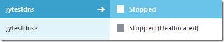

My "Stopped" VM still shows an allocated IP address:

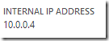

Compare this to a "Deallocated" VM:

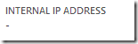

When you run "ipconfig /all", you'll notice that the DHCP lease for my machine lasts until 2149. 139 years from now I'll add a post explaining how to work around this. :-)

Create your virtual machine to host the DNS just like you would create any server. I highly recommend choosing **Windows Server 2012 or above**. It's highly optimized for Azure.

When you first remote into the server, you'll be presented with the _Server Manager_. From here, you can use the _Add roles and features_ wizard to enable the DNS server and dependencies.

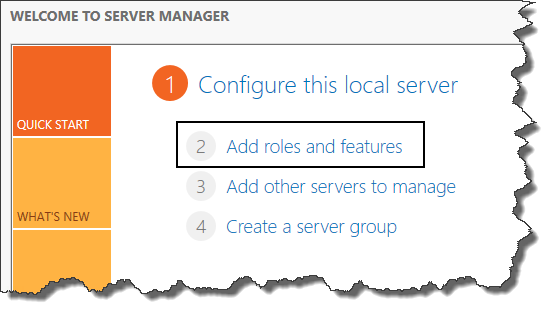

Check the _DNS Server_ option and click _Next_.

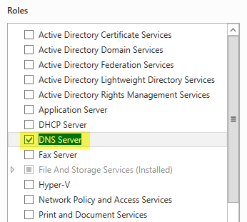

You will get a validation warning that your server should have a static IP address, but recall that our DHCP lease is effectively the same thing, so we can disregard.

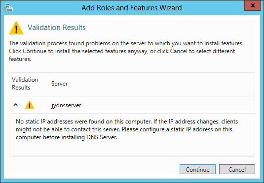

Complete the wizard (I kept all settings default).

###Configuring the DNS Service

In the left pane of the Server Manger, select the DNS section. If it doesn't show up, click in the pane and hit F5 to refresh.

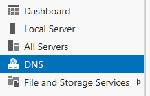

You'll see the server list in the right pane, and from here you can right-click and choose the _DNS Manager_ option.

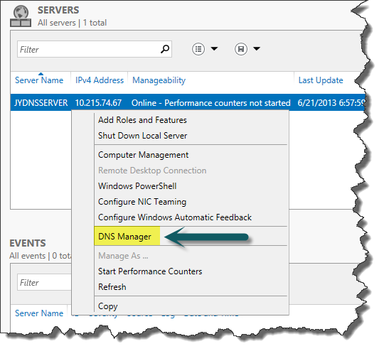

Expand the tree and find the _Forward Lookup Zones_ section. A [forward lookup zone](http://technet.microsoft.com/en-us/library/cc816891(v=ws.10).aspx) is a map of names and IP addresses, and is used to look up the IP address for one of those particular names. Think of it as a simple associative array that maps names to IP's. Right-click and choose _New Zone_.

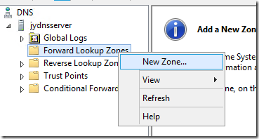

For the zone name, decide on what DNS suffix you would like to use, which means that this DNS server can handle queries with that DNS suffix. For example, if your DNS suffix is _my.net,_ you can use your DNS server to resolve *.my.net addresses.

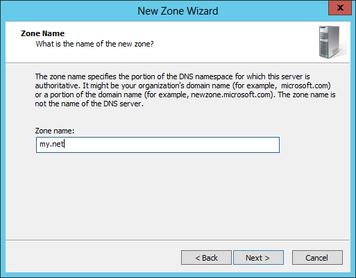

If you are not using the Azure VPN functionality, and you're building an Azure-only solution, you'll most likely want to allow non-secure updates (see my note on how to update the records later in this post). Secure updates are typically used on a domain, and are a useful way to ensure that only clients with the correct user permissions can update DNS. In our case, it's a pure server environment so the security concern is minimized (we won't have users mucking around in here).

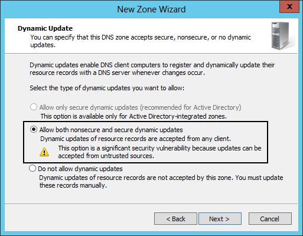

###Testing your DNS Server

To test our DNS server, we're simply going to create a record, and then query the server to ensure it gives a proper response.

First, right click in the _my.net_ forward lookup zone and choose _New Host_.

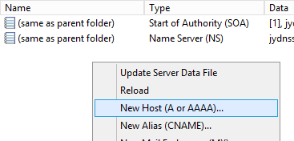

Create a test "A" record. The name is not important, we'll just need to remember what it is for the next step.

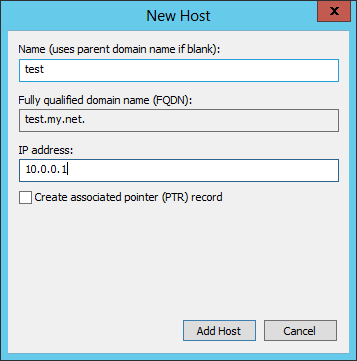

Open up a command prompt and run "nslookup", which will put us into interactive mode for queries. Set the DNS server by typing "server 127.0.0.1", which tells the session to use the local server (same machine that we're on). Now, type "test.my.net" to lookup the record. Confirm that the IP address returned matches what you entered for the DNS record. This would also be a good time to test a public address such as microsoft.com to ensure that addresses that the DNS server cannot resolve are passed to the upstream DNS server (this should work by default).

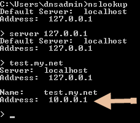

Next, you'll want to test your DNS server using the same steps, but from a different computer within the same network. Keep in mind that you'll need to use the IP address of the DNS server instead of 127.0.0.1 since we're no longer on the same VM as the DNS server.

###Configure DHCP

Azure provides a DHCP server out of the box, which hands out the Azure DNS server address by default. We want to go to the _Configure_ tab within our virtual network properties. Under the _dns servers_ section, enter a name to reference the DNS server (the name really doesn't matter). On the same line, enter the IP address of the server you configured in the previous steps. The next time a server within that network does a DHCP pull, or reboots, it will get the DNS server IP and start using the server you built.

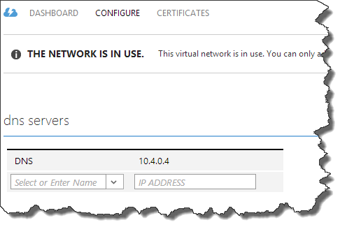

You may have noticed that it is also possible to define DNS servers from the standard New/Create feature in Azure. This only creates the DNS server as an option that can be selected on the Network-Configure screen. I have not found any particular reason to create entries this way.

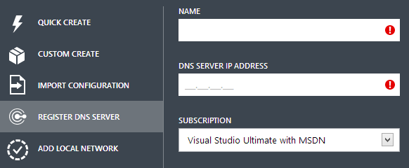

###Configure DNS Suffix

If you want to use short DNS names (eg: "test") instead of fully qualified names (eg: "test.my.net"), you'll need to update the DNS suffix of your virtual machine. Access the Advanced TCP/IP Settings (Network and Sharing Center->Change Adapter Settings->Ethernet Adapter->Properties->Internet Protocol Version 4->Advanced->DNS Tab) and set your DNS suffix as shown in the screenshot below.

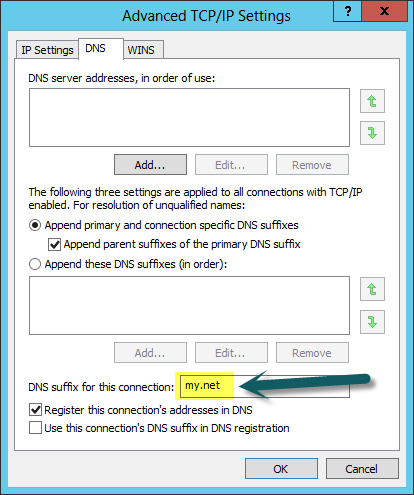

###Backup DNS

You should **always** configure at least 2 DNS servers and configure Azure to use both. This ensures that if one is rebooting, fails, etc. the other server can answer the DNS queries. It also ensures that if one machine becomes deallocated, your servers will failover and give you time to update the DNS settings for the newly assigned IP address of the re-built replacement server.

###Dynamic DNS Updating

In a typical on-premise DNS installation, the records are kept up-to-date by the DHCP server. Since we don't have control over our DHCP server, we have to update the records ourselves. In the interest of article length, I'll keep out the full details. This should get you started:

* For Windows, take a look at the PowerShell cmdlet called [Add-DnsServerResourceRecordA](http://technet.microsoft.com/en-us/library/jj649847.aspx).
* For Linux, take a look at a command called "[nsupdate](http://linux.die.net/man/8/nsupdate)".