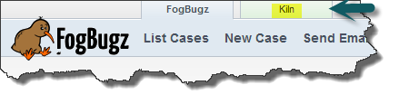
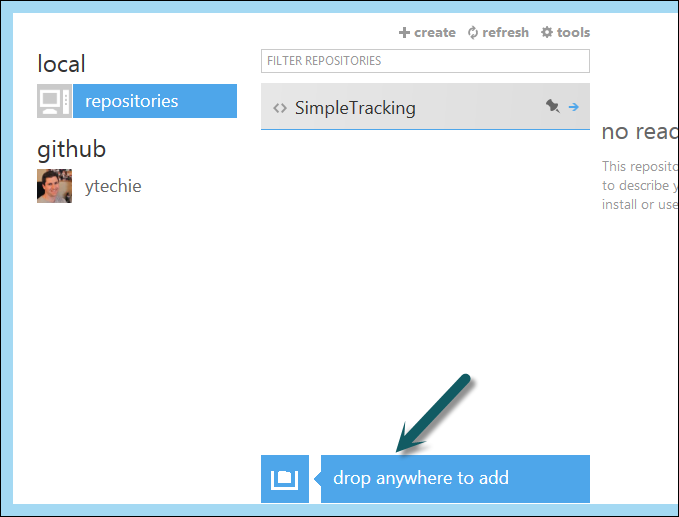
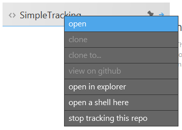
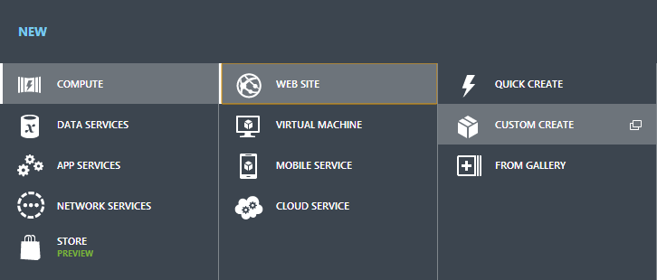
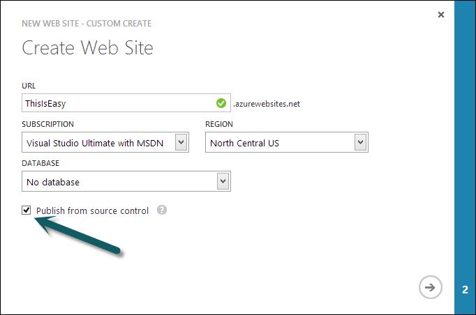
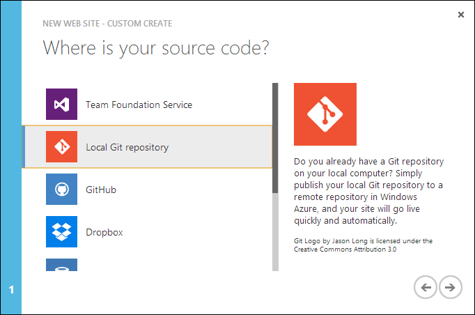
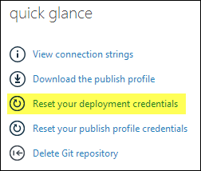
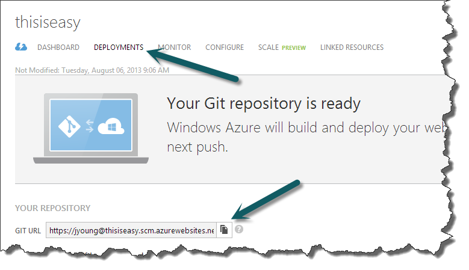
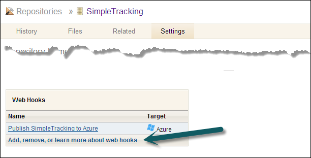

Setting up even a basic website with any server-side logic used to be difficult and time consuming. You needed a place to store the code (hopefully versioned), a build process, a deployment mechanism, and a hosting provider. Not to mention all of the setup that needed to occur before that.

I'm going to show you a dead simple process for getting started with a simple workflow that is free to start, and nearly free to sustain.

###Free PRIVATE Git Hosting

If you're project is public, you can use a service like GitHub. There are, however, many who want to keep their source code private. In this case we turn to FogBugz and their Kiln product.

Note: TFS is a more comprehensive solution, and has a [free tier for 5 users](http://tfs.visualstudio.com/en-us/pricing/tfs-information). I'm using Kiln in this example for simplicity, and to show third party interoperability.

Most people are not aware that they offer free bug tracking and unlimited source control, and they have a unique system called [Kiln Harmony](http://blog.fogcreek.com/announcing-kiln-harmony-the-future-of-dvcs/) that allows you to seamlessly transition between Mercurial and Git.

[Take a look a their pricing page](http://www.fogcreek.com/fogbugz/pricing.html), which confirms that as long as you are a startup or student and have 1 or 2 users, their service is completely free. If you have a company that only has 1 or 2 employees, I think it's safe to assume you're a startup.

Go ahead and [sign-up](https://secure.fogcreek.com/fogbugz/try/?fccmp=_tryfb_nav), log in, and move on to the next step.

###Push Your Code

 

Now, while logged in, click on the Kiln button to access the hosted source control product. Then, create a new repository (I'm not going to include a lot of detail here).

 

Once you have set up your repository, clone it locally using the provided URL, and add your source code:

	`git clone [http://URL_SUPPLIED_BY_KILN](http://URL_SUPPLIED_BY_KILN)`   

I like to use the [GitHub for Windows client](http://windows.github.com/), because it provides a great history viewer, an easy way to see pending changes, and provides a simple commit interface. You can use it _without_ using the GitHub website. However, if you DO want to use GitHub.com as well, it can automatically pull down your GitHub project list.

Adding local projects to GitHub is a breeze. Simply drag the project folder you cloned into the Window and you'll see it activate.

Once you have a repository added to GitHub, the context menu provides an easy way to view the folder in explorer, or even open a shell to use command line functionality. Double-clicking on the project will show revision history, pending changes with a commit dialog, and a sync button for the online repo (works for any Git remote, not just GitHub.com).

###Set up Azure

Set up an [Azure account](http://www.windowsazure.com/). If you have an MSDN account, you'll get free Azure time for dev/test. For production use, go ahead and get a [free trial](http://www.windowsazure.com/en-us/pricing/free-trial/). Don't worry, your website will be inexpensive, possibly even free to host. Azure offers a free hosting tier for websites, and a shared tier for only $9.68 as of the time of this writing.

Once you log in, familiarize yourself with the interface. To add an additional hosted service, use the  button at the bottom to bring up the service creation dialog and choose Compute -&gt; Web Site -&gt; Custom Create.

Creating a web site only requires a name. We'll also be checking the "Publish from source control" checkbox to create an Azure Git repository. We'll configure Kiln to push changes to this repository later.

To enable automated publishing, we need to tell our Azure website where our source code is located. There are options for TFS, GitHub, even Dropbox. Select the "Local Git repository" option.

On the right side, you'll want to choose the "Reset your deployment credentials" option. This will enable you to configure the username and password for your Git repository.

Now head over to the "Deployments" tab. This screen contains 2 key elements:

* The Git URL that when pushed to, will publish/deploy our project for us.
* A nearly real-time list of deployments and any success/error messages.  

###Automate!

Now, head back over to your Kiln repository, and click "Settings", and then "Add, remove..." under the Web Hooks section.

Now, fill in the publishing information:

1.  Friendly Rule Name (whatever helps you identify it).
2.  Choose Azure.
3.  The Git URL copied from the website in the Azure portal. Notice that it contains your username from your deployment credentials.
4.  The password you supplied for the deployment credentials in an earlier step.
5.  Select the repository that will be deployed.  

###Wasn't That Easy?

From this point on, every time you push your commits from your local repository, Kiln will automatically push your commits to the Azure repository and deploy your site. If you have problems, Kiln now supplies a web hook log on the hook configuration page, which will confirm if a call to Azure was made. The Azure deployments dialog will show the deployments and the corresponding log files.

###Additional Options

The goal of this post was to demonstrate only one of the many ways that you can quickly and easily go from code to website with minimal time and effort. There are some additional variations that you will likely want to investigate:

* If you want more fine-grained control over deployments, you can configure Kiln to push a branch. You can then selectively push to that branch when you want a new deployment.
* Instead of using a Kiln hook, you can simply set up an alternative Git endpoint in Azure, and push directly from the Git command line when you want to deploy. For example, you would run "git push Azure master".
* For additional deployment configuration such as specifying the project to deploy, project Kudu is the deployment mechanism. Their GitHub site has [additional deployment customization options](https://github.com/projectkudu/kudu/wiki/Customizing-deployments).